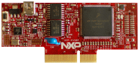

.. _hvpkv58f:

HVP-KV58F
####################

Overview
********

The HVP-KV58F controller card is a development platform for the Kinetis.KV5x family that, in combination with the HVP-MC3PH high-voltage development platform, provides ready-made software and hardware development for.high-voltage motor control and power conversion applications.

MCU device and part on board is shown below:

 - Device: MKV58F24
 - PartNumber: MKV58F1M0VLQ24

