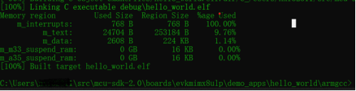

# Build an example application

To build an example application, follow these steps.

1.  Open the GCC Arm embedded toolchain command window. To launch the window on the Windows operating system, select **Start** -\> **Programs** -\> **GNU Tools ARM Embedded <version\>** -\> **GCC Command Prompt**.

    |

|

2.  Change the directory to the example application project directory, which has a path similar to the following:

    ```
    <install_dir>/boards/<board_name>/<example_type>/<application_name>/armgcc
    ```

    For this example, the exact path is:

    ```
    <install_dir>/boards/evkmimx8ulp/demo_apps/hello_world/armgcc
    ```

3.  Type `build_debug.bat` at the command-line or double-click the `build_debug.bat` file in Windows Explorer to perform the build. The output is as shown in [Figure 2](build_an_example_application.md#HELLOWORLDBUILDSUCCESS).

    |

|


**Note:** To run the application, see the [Run an application using imx-mkimage](running_an_application_using_imx-mkimage.md).

**Parent topic:**[Windows OS host](../topics/windows_os_host.md)

