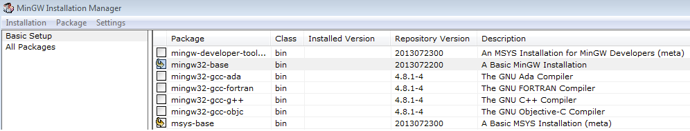
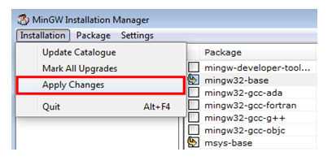
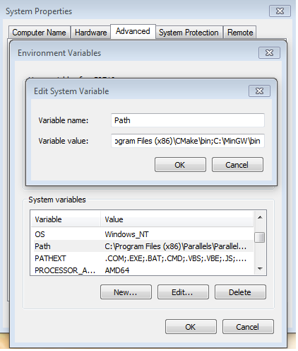
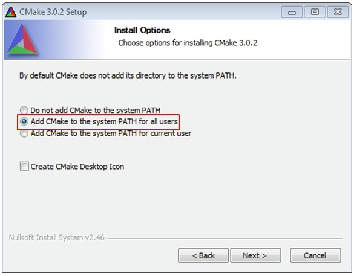

# How to set up Windows/Linux host system

An MCUXpresso SDK build requires that some packages are installed on the host. Depending on the used host operating system, the following tools should be installed.

**Linux**:

-   cmake

    ```
    $ sudo apt-get install cmake $ # Check the version >= 3.0.x $ cmake –-version
    ```


**Windows:**

-   MinGW

    The Minimalist GNU for Windows OS \(MinGW\) development tools provide a set of tools that are not dependent on third-party C-Runtime DLLs \(such as Cygwin\). The build environment used by the SDK does not utilize the MinGW build tools, but does leverage the base install of both MinGW and MSYS. MSYS provides a basic shell with a Unix-like interface and tools.

    1.  Download the latest MinGW mingw-get-setup installer from [sourceforge.net/projects/mingw/files/Installer/](http://sourceforge.net/projects/mingw/files/Installer/).
    2.  Run the installer. The recommended installation path is `C:\MinGW`, however, you may install to any location.

        **Note:** The installation path should not contain any spaces.

    3.  Ensure that **mingw32-base** and **msys-base** are selected under **Basic Setup**.

        |

|

    4.  Click **Apply Changes** in the **Installation** menu and follow the remaining instructions to complete the installation.

        |

|

    5.  Add the appropriate item to the Windows operating system path environment variable. It can be found under **Control Panel**-\>**System and Security**-\>**System**-\>**Advanced System Settings** in the **Environment Variables** section. The path is: `<mingw_install_dir>\bin`.

        Assuming the default installation path, `C:\MinGW`, an example is as shown in [Figure 3](how_to_set_up_windows_linux_host_system.md#ADDINGPATH). If the path is not set correctly, the toolchain does not work.

        **Note:** If you have `C:\MinGW\msys\x.x\bin` in your `PATH` variable \(as required by Kinetis SDK v2.10.0\), remove it to ensure that the new GCC build system works correctly.

        |

|

-   CMake

    1.  Download CMake 3.0.x from [www.cmake.org/cmake/resources/software.html](http://www.cmake.org/cmake/resources/software.html).
    2.  While installing, ensure that the option **Add CMake to system PATH for all users** is selected. You can select install CMake into the path for all users or just the current user. In this example, it is installed for all users.

        |

|

    3.  Follow the remaining instructions of the installer.
    4.  Reboot your system for the path changes to take effect.

