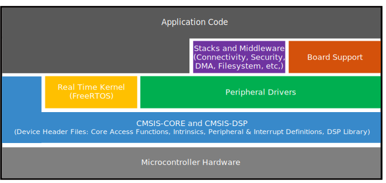

# Overview

The NXP MCUXpresso software and tools offer comprehensive development solutions designed to optimize, ease, and help accelerate embedded system development of applications based on general purpose, crossover, and Bluetooth-enabled MCUs from NXP. The MCUXpresso SDK includes a flexible set of peripheral drivers designed to speed up and simplify development of embedded applications which can be used standalone or collaboratively with the A cores running another Operating System \(such as Linux OS Kernel\). Along with the peripheral drivers, the MCUXpresso SDK provides an extensive and rich set of example applications covering everything from basic peripheral use case examples to demo applications. The MCUXpresso SDK also contains optional RTOS integrations such as FreeRTOS and Azure RTOS, device stack, and various other middleware to support rapid development.

For supported toolchain versions, see the *MCUXpresso SDK Release Notes Supporting i.MX 7ULP Derivatives* \(document MCUXSDKIMX7ULPRN\)

For the latest version of this and other MCUXpresso SDK documents, see the MCUXpresso SDK homepage [MCUXpresso-SDK: Software Development Kit for MCUXpresso.](http://www.nxp.com/products/software-and-tools/run-time-software/mcuxpresso-software-and-tools/mcuxpresso-software-development-kit-sdk:MCUXpresso-SDK)

|

|

