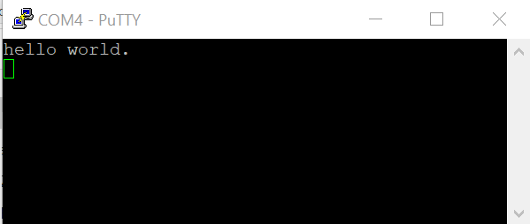

# Run an example application

To download and run the application, perform these steps:

1.  This board supports the J-Link PLUS debug probe. Before using it, install SEGGER J-Link software, which can be downloaded from [http://www.segger.com/downloads/jlink/](http://www.segger.com/downloads/jlink/).
2.  Connect the development platform to your PC via USB cable between the USB-UART MICRO USB connector and the PC USB connector, then connect power supply and J-Link Plus to the device.
3.  Open the terminal application on the PC, such as PuTTY or TeraTerm, and connect to the debug COM port \(to determine the COM port number, see [How to determine COM port](how_to_determine_com_port.md#)\). Configure the terminal with these settings:
    1.  115200 baud rate
    2.  No parity
    3.  8 data bits
    4.  1 stop bit

        | configuration")

|

4.  In IAR, click **Download and Debug** to download the application to the target.

    |

|

5.  The application then downloads to the target and automatically runs to the `main()` function.

    | when running debugging")

|

6.  Run the code by clicking **Go** to start the application.

    |

|

7.  The `hello_world` application now runs and a banner appears on the terminal. If this does not occur, check your terminal settings and connections.

    |

|

    **Note:** For downloading the DDR target application, insert one TF card with U-Boot code. This is required both on IAR and GCC.

    **Note:** For converting the DDR target elf to bin, run the following commands (take git bash console as example).
    1. For the elf file built by Arm GCC:
      $ <ARMGCC PATH>/bin/arm-none-eabi-objcopy.exe -Obinary --remove-section=.stacktop_and_pc <hello_world_<mcore type>.elf> <hello_world_<mcore type>.bin>

    2. For the elf/out file built by IAR:
      $ <ARMGCC PATH>/bin/arm-none-eabi-objcopy.exe --remove-section=.stacktop_and_pc hello_world_<mcore type>.elf hello_world_<mcore type>_stripped.elf
      $ <IAR PATH>/arm/bin/ielftool.exe --bin hello_world_<mcore type>_stripped.elf hello_world_<mcore type>.bin

**Parent topic:**[Run a demo application using IAR](../topics/run_a_demo_application_using_iar.md)

