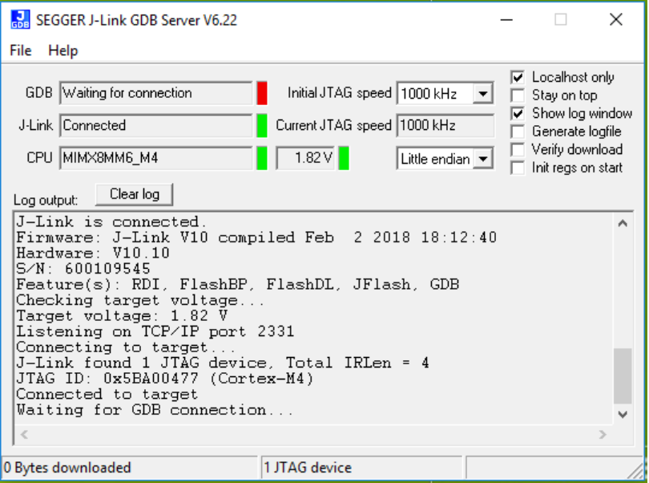

# Run an example application

This section describes steps to run a demo application using J-Link GDB Server application. To perform this exercise, the following step must be done:

-   You have a standalone J-Link pod that is connected to the debug interface of your board.

After the J-Link interface is configured and connected, follow these steps to download and run the demo applications:

1.  Connect the development platform to your PC via USB cable between the USB-UART connector and the PC USB connector. If using a standalone J-Link debug pod, also connect it to the SWD/JTAG connector of the board.
2.  Open the terminal application on the PC, such as PuTTY or TeraTerm, and connect to the debug serial port number \(to determine the COM port number, see [How to determine COM port](how_to_determine_com_port.md#)\). Configure the terminal with these settings:
    1.  115200 baud rate
    2.  No parity
    3.  8 data bits
    4.  1 stop bit

        | configurations")

|

3.  After GDB server is running, the screen should resemble [Figure 2](run_an_example_application_003.md#SEGGGERJKLINKSUCCESS):

    |

|

4.  If not already running, open a GCC Arm Embedded tool chain command window. To launch the window, from the Windows operating system **Start** menu, go to **Programs** -\> **GNU Tools Arm Embedded <version\>** and select **GCC Command Prompt**.

    |

|

5.  Change to the directory that contains the example application output. The output can be found in using one of these paths, depending on the build target selected:

    ```
    <install_dir>/boards/<board_name>/<example_type>/<application_name>/armgcc/debug
    ```

    ```
    <install_dir>/boards/<board_name>/<example_type>/<application_name>/armgcc/release
    ```

    For this example, the path is:

    ```
    <install_dir>/boards/evkmimx8mm/demo_apps/hello_world/armgcc/debug
    ```

6.  Run the command of `arm-none-eabi-gdb.exe <application_name>.elf`. For this example, it is `arm-none-eabi-gdb.exe hello_world.elf`.

    |

|

7.  Run these commands:
    1.  `target remote localhost:2331`
    2.  `monitor reset`
    3.  `monitor halt`
    4.  `load`
8.  The application is now downloaded and halted at the reset vector. Execute the `monitor go` command to start the demo application.

The `hello_world` application is now running and a banner is displayed on the terminal. If this is not true, check your terminal settings and connections.

|

|

**Parent topic:**[Windows OS host](../topics/windows_os_host.md)

