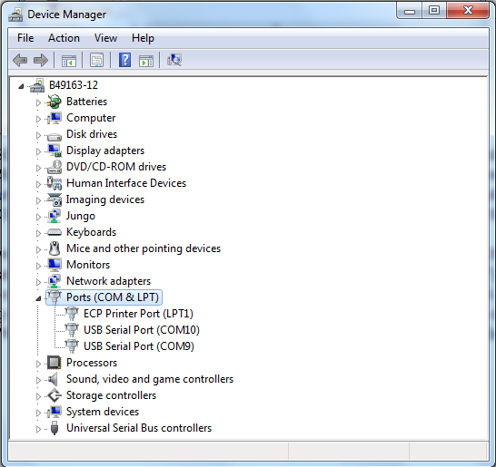
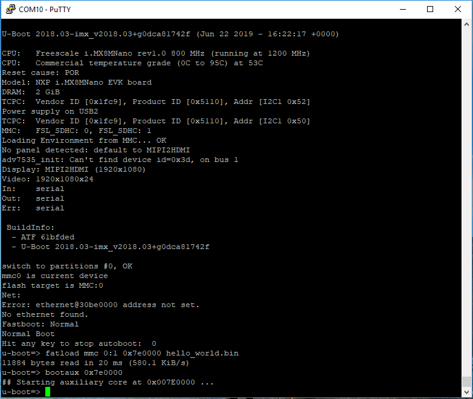
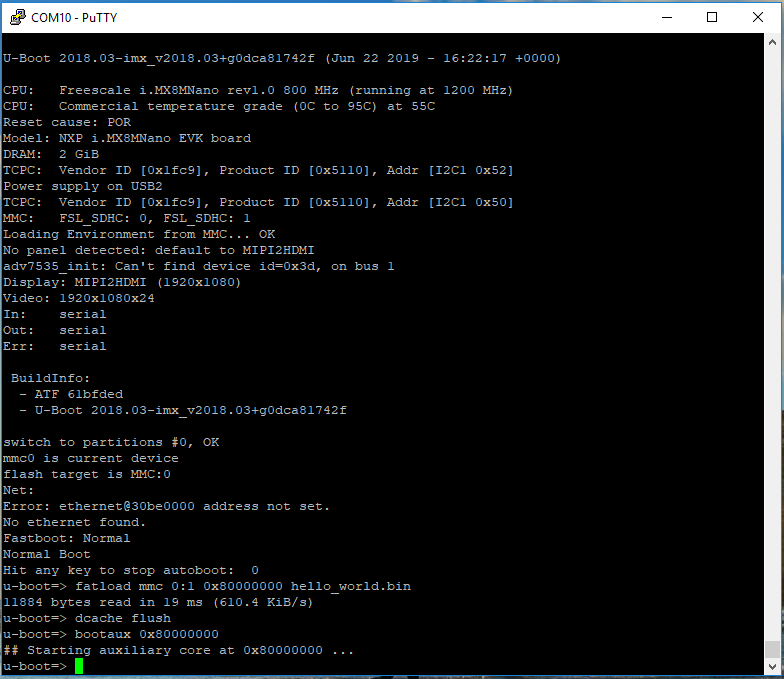
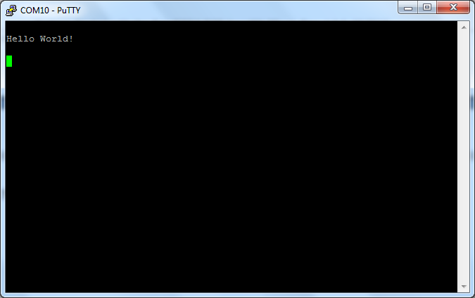

# Running an application by U-Boot

This section describes the steps to write a bootable SDK bin file to TCM or DRAM with the prebuilt U-Boot image for the i.MX processor. The following steps describe how to use the U-Boot:

1.  Connect the **DEBUG UART** slot on the board to your PC through the USB cable. The Windows OS installs the USB driver automatically, and the Ubuntu OS finds the serial devices as well.
2.  On Windows OS, open the device manager, find **USB serial Port** in **Ports \(COM and LPT\)**. Assume that the ports are COM9 and COM10. One port is for the debug message from the Cortex-A53 and the other is for the Cortex-M7. The port number is allocated randomly, so opening both is beneficial for development. On Ubuntu OS, find the TTY device with name `/dev/ttyUSB*` to determine your debug port. Similar to Windows OS, opening both is beneficial for development.

    |

|

3.  Build the application \(for example, `hello_world`\) to get the bin file \(`hello_world.bin`\).
4.  Prepare an SD card with the prebuilt U-Boot image and copy bin file \(`hello_world.bin`\) into the SD card. Then, insert the SD card to the target board. Make sure to use the default boot SD slot and check the dipswitch configuration.
5.  Open your preferred serial terminals for the serial devices, setting the speed to 115200 bps, 8 data bits, 1 stop bit \(115200, 8N1\), no parity, then power on the board.
6.  Power on the board and hit any key to stop autoboot in the terminals, then enter to U-Boot command line mode. You can then write the image and run it from TCM or DRAM with the following commands:

    1.  If the `hello_world.bin` is made from the debug/release target, which means the binary file will run at TCM, use the following commands to boot:
        -   `fatload mmc 1:1 0x48000000 hello_world.bin`
        -   `cp.b 0x48000000 0x7e0000 0x20000`
        -   `bootaux 0x7e0000`
    2.  If the `hello_world.bin` is made from the `ddr_debug`/`ddr_release` target, which means the binary file runs at DRAM, use the following commands:
        -   `fatload mmc 1:1 0x80000000 hello_world.bin`
        -   `dcache flush`
        -   `bootaux 0x80000000`
    3.  If the hello\_world.bin is made from the `flash_debug/flash_release`target, which means the binary file runs at nor\_flash, use the following commands:
        -   `sf probe`
        -   `sf read 0x80000000 0 4`
        -   `fatload mmc 1:1 0x80000000 flash.bin`
        -   `dcache flush`
        -   `sf erase 0 0x20000`
        -   `sf write 0x80000000 0 0x20000`
        -   `bootaux 0x8000000`
    **Note:** If the Linux OS kernel runs together with M7, make sure the correct `dtb` file is used. This `dtb` file reserves resources used by M7 and avoids the Linux kernel from configuring them. Use the following command in U-Boot before running the kernel:

    -   DDR4 board

        ```
        setenv fdtfile ‘fsl-imx8mn-ddr4-evk-rpmsg.dtb’
        save
        ```

    -   LPDDR4 board

        ```
        setenv fdtfile ‘fsl-imx8mn-evk-rpmsg.dtb’
        save
        ```

    **Note:** For Linux release version L5.15.71-2.2.0 and later, the `run prepare_mcore` command must run before the `bootaux` command.

    |

|

    |

|

7.  Open another terminal application on the PC, such as PuTTY and connect to the debug COM port \(to determine the COM port number, see [How to determine COM port](how_to_determine_com_port.md#)\). Configure the terminal with these settings:
    -   115200
    -   No parity
    -   8 data bits
    -   1 stop bit
8.  The `hello_world` application is now running and a banner is displayed on the terminal. If this is not true, check your terminal settings and connections.

    |

|


