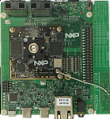

:pdf-download: ../../../_assets/boards/evkmimx8mn/mcuxsdk-evkmimx8mn.pdf
.. _evkmimx8mn:

EVK-MIMX8MN
####################

Overview
********

The i.MX 8M Nano family of boards provides a powerful and flexible development system for NXP's Cortex-M7 MCUs.

MCU device and part on board is shown below:

 - Device: MIMX8MN6
 - PartNumber: MIMX8MN6DVTJZ
 
Getting Started with MCUXpresso SDK Package
*******************************************
.. toctree::
   :maxdepth: 1

   gettingStarted/gsindex.md

Getting Started with MCUXpresso SDK GitHub
*******************************************
.. toctree::
   :maxdepth: 1

   ../../../gsd/repo.rst

Release Notes
*******************************************
.. toctree::
   :maxdepth: 1

   releaseNotes/rnindex.md

ChangeLog
*******************************************
.. toctree::
   :maxdepth: 1

   changeLog/clindex.md

Driver API Reference Manual
****************************

This section provides a link to the Driver API RM, detailing available drivers and their usage to help you integrate hardware efficiently.

:ref:`MIMX8MN6_drivers`

Middleware Documentation
*****************************

Find links to detailed middleware documentation for key components. While not all onboard middleware is covered, this serves as a useful reference for configuration and development.

Multicore
=========

:ref:`multicore`

FreeMASTER
==========

.. toctree::
   :maxdepth: 1

   ../../../middleware/freemaster/doc/index.md

FreeRTOS
========

:ref:`freertos`
