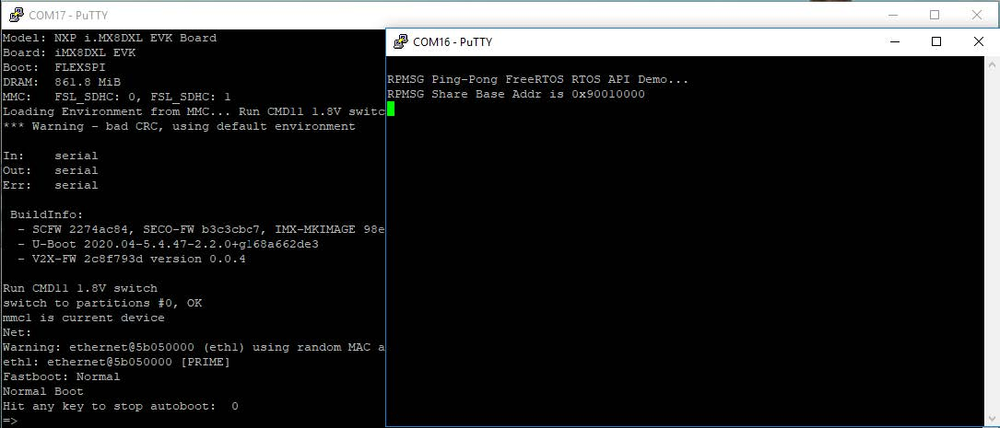
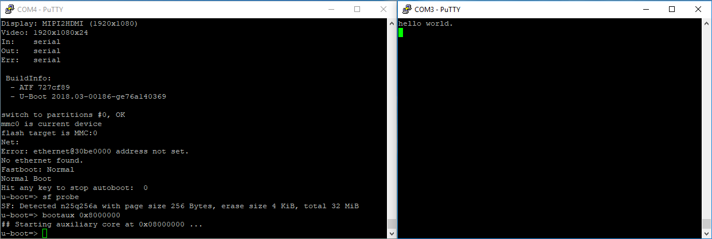

# Run an example application

To download and run the application via UUU, perform these steps:

1.  Connect the development platform to your PC via USB cable between the J901 USB DEBUG connector and the PC. It provides console output while using UUU.
2.  Connect the J301 USB Type-C connector and the PC. It provides the data path for UUU.
3.  Open the terminal application on the PC, such as PuTTY or TeraTerm, and connect to the debug COM port \(to determine the COM port number, see [How to determine COM port](how_to_determine_com_port.md#)\). Configure the terminal with these settings:

    1.  115200 baud rate
    2.  No parity
    3.  8 data bits
    4.  1 stop bit
    | configuration")

|

4.  Get the fspi version U-Boot image from release package and rename it to `uboot_flash.bin`.
5.  In the command line, execute uuu with the *-b qspi* switch: `uuu -b qspi uboot_flash.bin m7_flash.bin` .

    The UUU puts the platform into fast boot mode and automatically flashes the target bootloader to QSPI. The command line and fast boot console is as shown in [Figure 2](run_an_example_application.md#COMMANDLINSEFASTBOOT).

    |

|

6.  Then, power off the board and change the boot mode to `MicroSD Mode [SW1101:1100[1-4]]` , and power on the board again.

    |

|

7.  Use following command in U-Boot to kickoff m7:

    ```
    sf probe
    sf read ${loadaddr} 0 4
    bootaux 0x8000000
    ```

    |

|


**Parent topic:**[Run a flash target demo by UUU](../topics/run_a_flash_target_demo_by_uuu.md)

