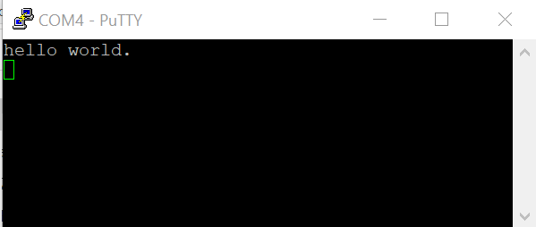

# Run an example application

This section describes steps to run a demo application using J-Link GDB Server application.

After the J-Link interface is configured and connected, follow these steps to download and run the demo applications:

1.  Connect the development platform to your PC via USB cable between the USB-UART connector and the PC USB connector. If using a standalone J-Link debug pod, also connect it to the SWD/JTAG connector of the board.
2.  Open the terminal application on the PC, such as PuTTY or TeraTerm, and connect to the debug serial port number \(to determine the COM port number, see [How to determine COM port](how_to_determine_com_port.md#)\). Configure the terminal with these settings:
    1.  115200 baud rate, depending on your board \(reference `BOARD_DEBUG_UART_BAUDRATE` variable in the `board.h` file\)
    2.  No parity
    3.  8 data bits
    4.  1 stop bit

        | configurations")

|

3.  Open the J-Link GDB Server application. Assuming the J-Link software is installed, the application can be launched from a new terminal for the MIMX8ML\_M7 device:

    ```
    $ JLinkGDBServer -if JTAG -device
    SEGGER J-Link GDB Server  Command Line Version
    JLinkARM.dll
    Command line: -if JTAG -device MIMX8ML8\_M7
    -----GDB Server start settings-----
    GDBInit file: none
    GDB Server Listening port: 2331
    SWO raw output listening port: 2332
    Terminal I/O port: 2333
    Accept remote connection: yes
    < -- Skipping lines -- >
    Target connection timeout: 0 ms
    ------J-Link related settings------
    J-Link Host interface: USB
    J-Link script: none
    J-Link settings file: none
    ------Target related settings------
    Target device:
    Target interface: JTAG
    Target interface speed: 1000 kHz
    Target endian: little
    Connecting to J-Link...
    J-Link is connected.
    Firmware: J-Link V10 compiled Feb 2 2020 18:12:40
    Hardware: V10.10
    S/N: 600109545
    Feature(s): RDI, FlashBP, FlashDL, JFlash, GDB
    Checking target voltage...
    Target voltage: 1.82 V
    Listening on TCP/IP port 2331
    Connecting to target...
    J-Link found 1 JTAG device, Total IRLen = 4
    JTAG ID: 0x5BA00477 \(Cortex-M7\)
    Connected to target
    Waiting for GDB connection...
    ```

4.  Change to the directory that contains the example application output. The output can be found in using one of these paths, depending on the build target selected:

    `<install_dir>/boards/<board_name>/<example_type>/<application_name>/armgcc/debug`

    `<install_dir>/boards/<board_name>/<example_type>/<application_name>/armgcc/release`

    For this example, the path is:

    `*<install\_dir\>/boards/evkmimx8mp/demo\_apps/hello\_world/armgcc/debug*`

5.  Start the GDB client:

    ```
    $ arm-none-eabi-gdb hello_world.elf
    GNU gdb (GNU Tools for Arm Embedded Processors 9-2019-q4-major) 8.3.0.20190709-git
    Copyright (C) 2019 Free Software Foundation, Inc.
    License GPLv3+: GNU GPL version 3 or later <http://gnu.org/licenses/gpl.html>
    This is free software: you are free to change and redistribute it.
    There is NO WARRANTY, to the extent permitted by law.
    Type "show copying" and "show warranty" for details.
    This GDB was configured as "--host=i686-w64-mingw32 --target=arm-none-eabi".
    Type "show configuration" for configuration details.
    For bug reporting instructions, please see:
    <http://www.gnu.org/software/gdb/bugs/>.
    Find the GDB manual and other documentation resources online at:
       <http://www.gnu.org/software/gdb/documentation/>.
    For help, type "help".
    Type "apropos word" to search for commands related to "word"...
    Reading symbols from hello_world.elf...
    (gdb)
    ```

6.  Connect to the GDB server and load the binary by running the following commands:

    1.  `target remote localhost:2331`
    2.  `monitor reset`
    3.  `monitor halt`
    4.  `load`
    ```
    
    (gdb) target remote localhost:2331
    Remote debugging using localhost:2331
    0x00000008 in \_\_isr\_vector \(\)
    (gdb) monitor reset
    Resetting target
    (gdb) monitor halt
    (gdb) load
    Loading section .interrupts, size 0x240 lma 0x0
    Loading section .text, size 0x3ab8 lma 0x240
    Loading section .ARM, size size 0x8 lma 0x3cf8
    Loading section .init\_array, size 0x4 lma 0x3d00
    Loading section .fini\_array, size 0x4 lma 0x3d04
    Loading section .data, size 0x64 lma 0x3d08
    Start address 0x2f4, load size 15724
    Transfer rate: 264 KB/sec, 2620 bytes/write.
    \(gdb\)
    
    
    ```


The application is now downloaded and halted at the reset vector. Execute the `monitor go` command to start the demo application.

```
(gdb) monitor go
```

The `hello_world` application is now running and a banner is displayed on the terminal. If this is not true, check your terminal settings and connections.

|

|

**Parent topic:**[Linux OS host](../topics/linux_os_host.md)

