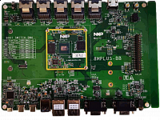

.. _evkmimx8mp:

EVK-MIMX8MP
####################

Overview
********

The i.MX 8M Plus family of boards provides a powerful and flexible development system for NXP's Cortex-M7 MCUs.

MCU device and part on board is shown below:

 - Device: MIMX8ML8
 - PartNumber: MIMX8ML8DVNLZ

Getting Started
****************
.. toctree::
   :maxdepth: 1
   :caption: Getting Started with MCUXpresso SDK for EVK-MIMX8MP

   gettingStarted/gsindex.md

Release Notes
****************
:doc:`MCUXpresso SDK Release Notes for EVK-MIMX8MP <../../../release/index>`
