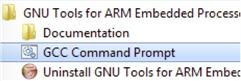
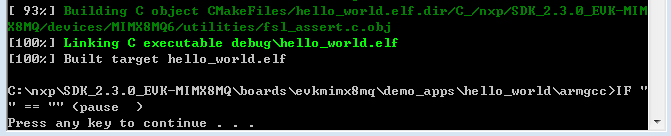

# Build an example application

To build an example application, follow these steps.

1.  Change the directory to the example application project directory, which has a path similar to the following:

    *<install\_dir\>/boards/<board\_name\>/<example\_type\>/<application\_name\>/<core\_instance\>/armgcc*

    For this example, the exact path is: *<install\_dir\>/boards/evkmimx8mq/demo\_apps/hello\_world/armgcc*

    **Note:** To change directories, use the 'cd' command.

2.  Open a GCC Arm Embedded tool chain command window. To launch the window, from the Windows operating system Start menu, go to “Programs -\> GNU Tools ARM Embedded <version\>” and select “GCC Command Prompt”.

    |

|

3.  Type “build\_debug.bat” on the command line or double click on the "build\_debug.bat" file in Windows Explorer to perform the build. The output is shown in this figure:

    |

|

**Parent topic:**[Windows OS host](../topics/windows_os_host.md)

