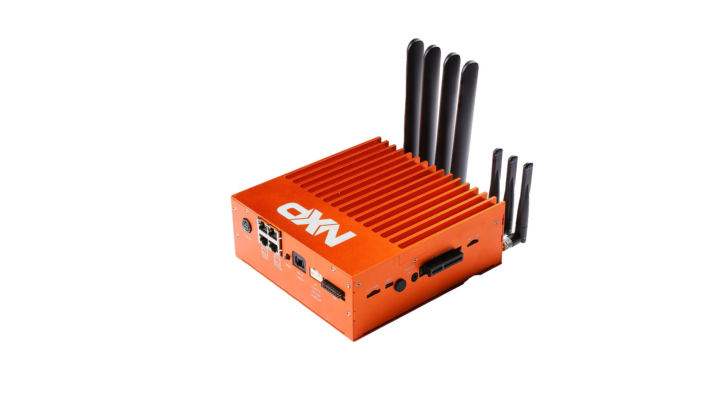

:pdf-download: ../../../_assets/boards/imx943_orangebox/mcuxsdk-imx943_orangebox.pdf
.. _imx943_orangebox:

IMX943EVK
###############

**Note:**

IMX943-ORANGEBOX = IMX943LP5CPU-19 SOM + X-OBX2-CDC-MB(connectivity domain controller main board)

Overview
********

The MCU device and the part number on the board is shown below:

 - Device: MIMX94398
 - PartNumber: MIMX94398AVKM
 **Note:**
   IMX943LP5CPU-19 SOM board uses the PartNumber MIMX94398AVKM

Getting Started with MCUXpresso SDK Package
*******************************************
.. toctree::
   :maxdepth: 1

   gettingStarted/gsindex.md

Getting Started with MCUXpresso SDK GitHub
*******************************************
.. toctree::
   :maxdepth: 1

   ../../../gsd/repo.rst

Release Notes
*******************************************
.. toctree::
   :maxdepth: 1

   releaseNotes/rnindex.md

ChangeLog
*******************************************
.. toctree::
   :maxdepth: 1

   changeLog/clindex.md

Driver API Reference Manual
****************************

This section provides a link to the Driver API RM, detailing available drivers and their usage to help you integrate hardware efficiently.

:ref:`MIMX94398_drivers`

Middleware Documentation
*****************************

Find links to detailed middleware documentation for key components. While not all onboard middleware is covered, this serves as a useful reference for configuration and development.

Multicore
=========

:ref:`multicore`

FreeMASTER
==========

:doc:`freemaster <../../../middleware/freemaster/doc/index>`

FreeRTOS
========

:ref:`freertos`

lwIP
====

:ref:`lwip`
