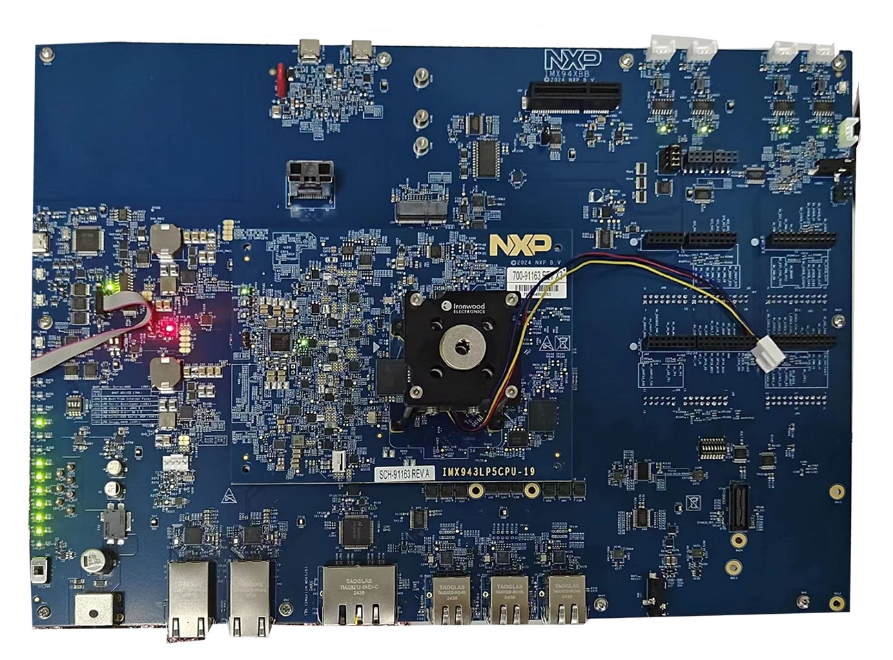

.. _imx943evk:

IMX943EVK
###############

**Note:**

IMX943EVK includes IMX943-19X19-LPDDR5-EVK, IMX943-19X19-LPDDR4-EVK, IMX943-15X15-LPDDR4-EVK

IMX943 19x19 LPDDR5 EVK(IMX943LP5EVK-19) = IMX943LP5CPU-19 SOM + X-IMX943BB

IMX943 19x19 LPDDR4 EVK(IMX943LP4EVK-19) = IMX943LP4CPU-19 SOM + X-IMX943BB

IMX943 15x15 LPDDR4 EVK(IMX943LP4EVK-15) = IMX943LP4CPU-15 SOM + X-IMX943BB

Overview
********

MCU device and part on board is shown below:

 - Device: MIMX94398
 - PartNumber: MIMX94398AVKM

Getting Started with MCUXpresso SDK Package
*******************************************
.. toctree::
   :maxdepth: 1

   gettingStarted/gsindex.md

Getting Started with MCUXpresso SDK GitHub
*******************************************
.. toctree::
   :maxdepth: 1

   ../../../gsd/repo.rst

Release Notes
*******************************************
.. toctree::
   :maxdepth: 1

   releaseNotes/rnindex.md

ChangeLog
*******************************************
.. toctree::
   :maxdepth: 1

   changeLog/clindex.md
