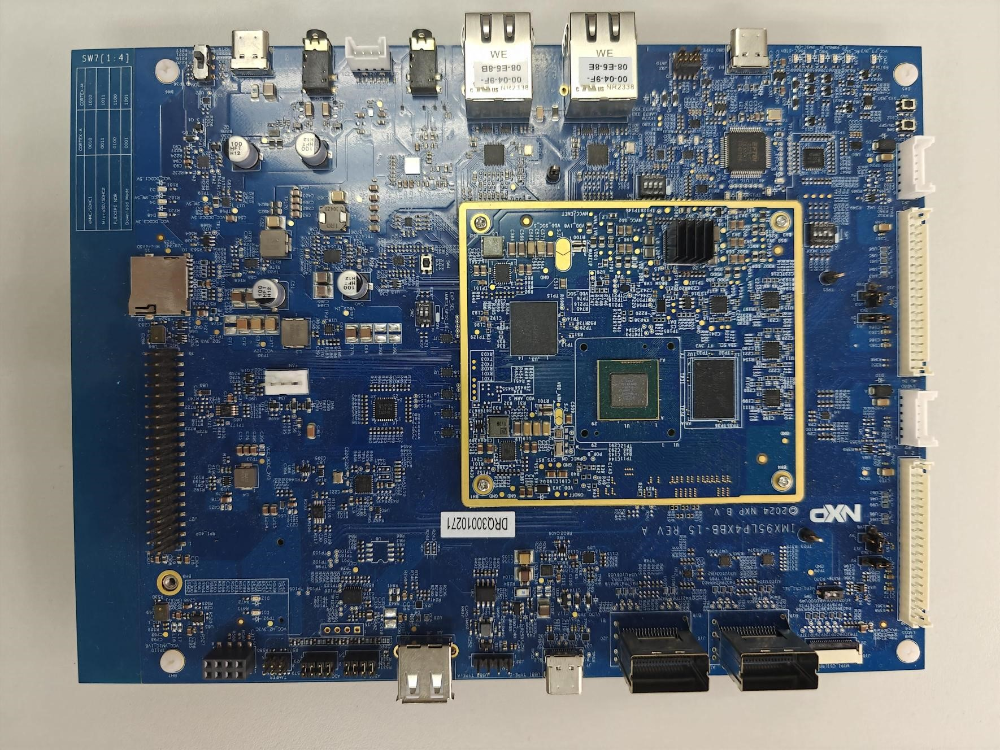

.. _imx95lp4xevk15:

IMX95LP4XEVK-15
###############

Overview
********

MCU device and part on board is shown below:

 - Device: MIMX9596
 - PartNumber: MIMX9596AVTXN

Getting Started with MCUXpresso SDK Package
*******************************************
.. toctree::
   :maxdepth: 1

   ../imx95lpd5evk19/gettingStarted/gsindex.md

Getting Started with MCUXpresso SDK GitHub
*******************************************
.. toctree::
   :maxdepth: 1

   ../../../gsd/repo.rst

Release Notes
*******************************************
.. toctree::
   :maxdepth: 1

 releaseNotes/rnindex.md

ChangeLog
*******************************************
.. toctree::
   :maxdepth: 1

   changeLog/clindex.md
