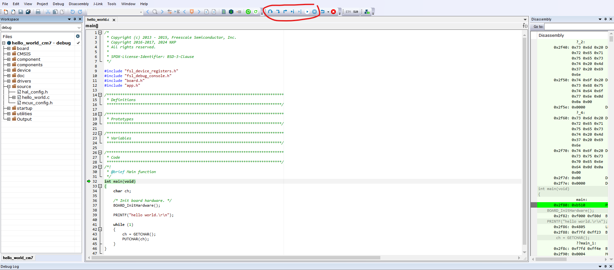

# Debug an demo application with IAR

To debug an application with IAR, perform these steps:

1.  download the patch for IAR and Segger J-Link from [the NXP website](https://www.nxp.com/webapp/Download?colCode=iar_segger_support_patch_imx95_240807&appType=license), install it as readme in the patch.
2.  burn a flash.bin to board, see [Run a demo application](run_a_demo_application.md#), make sure the size of M7 binary in flash.bin not less than the binary you want to debug.
3.  power on the board, make sure the M7 is booted by SM
4.  Open hello world example with IAR, click **download and debug** to debug

    |
5.  click button such as **step over** to debug

    |

**Parent topic:**[Run a demo application](../topics/run_a_demo_application.md)

