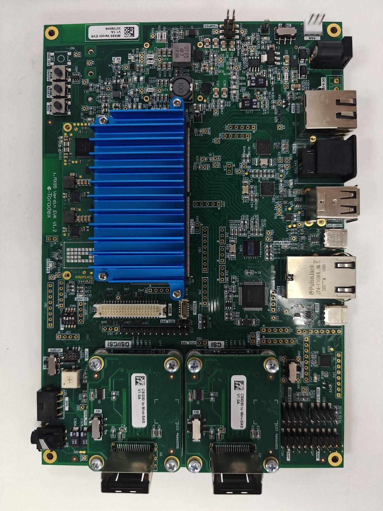

.. _imx95verdinevk:

IMX95VERDINEVK
##############

Overview
********

MCU device and part on board is shown below:

 - Device: MIMX9596
 - PartNumber: MIMX9596AVZXN

Getting Started
****************
.. toctree::
   :maxdepth: 1
   :caption: Getting Started with MCUXpresso SDK for IMX95LPD5EVK-19, IMX95LP4XEVK-15, and IMX95VERDINEVK

   ../imx95lpd5evk19/gettingStarted/gsindex.md

Release Notes
****************
.. toctree::
   :maxdepth: 1
   :caption: MCUXpresso SDK Release Notes for IMX95LPD5EVK-19, IMX95LP4XEVK-15, and IMX95VERDINEVK

   ../imx95lpd5evk19/releaseNotes/rnindex.md

