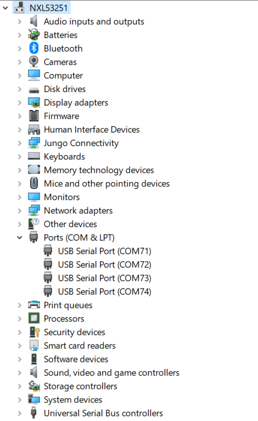
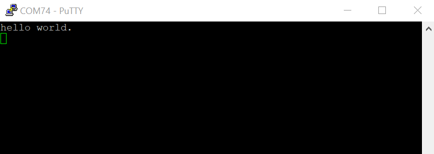

# Running an application by U-Boot

This section describes the steps to write a bootable SDK bin file to TCM with the prebuilt U-Boot image for the i.MX processor. The following steps describe how to use the U-Boot:

1.  Connect the **DEBUG UART** slot on the board to your PC through the USB cable. The Windows OS installs the USB driver automatically, and the Ubuntu OS finds the serial devices as well.
2.  On Windows OS, open the device manager, find **USB serial Port** in **Ports \(COM & LPT\)**. Assume that the ports are COM71 - COM74. COM73 is for the debug message from the Cortex-A55 and COM74 is for the Cortex-M33. The port number is allocated randomly, so opening both is beneficial for development. On Ubuntu OS, find the TTY device with name `/dev/ttyUSB*` to determine your debug port. Similar to Windows OS, opening both is beneficial for development.

    |

|

3.  Build the application \(for example, `hello_world`\) to get the bin file \(`hello_world.bin`\).
4.  Prepare an SD card with the prebuilt Linux BSP flashed and copy bin file \(`hello_world.bin`\) into the SD card.
5.  Insert the SD card to the target board. Make sure to switch SW601\[1:4\] is configured to MicroSD A core boot 0b0011.
6.  Open your preferred serial terminals for the serial devices, setting the speed to 115200 bps, 8 data bits, 1 stop bit \(115200, 8N1\), no parity, then power on the board.
7.  Power on the board and hit any key to stop autoboot in the A55 terminal.
8.  Enter to U-Boot command line mode. You can then write the image and run it from TCM with the following commands:
    -   `fatload mmc 1:1 80000000 hello_world.bin; cp.b 0x80000000 0x201e0000 0x10000;`
    -   `bootaux 0x1ffe0000 0`
9.  The `hello_world` application is now running and a banner is displayed on the M33 terminal. If this is not true, check your terminal settings and connections.

    |

|

