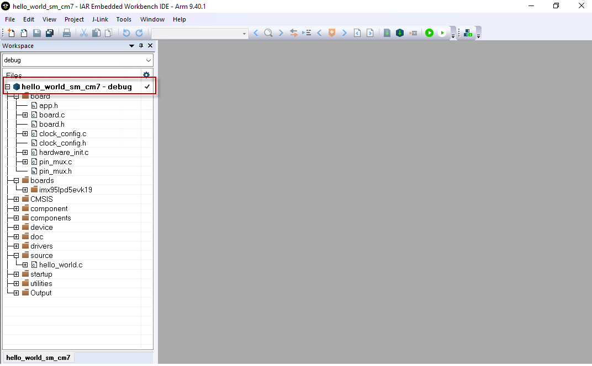

# Build an example application

The following steps guide you through opening the `hello_world_sm` example application. These steps may change slightly for other example applications, as some of these applications may have additional layers of folders in their paths.

1.  If not already done, open the desired demo application workspace. Most example application workspace files can be located using the following path:

    ```
    <install_dir>/boards/<board_name>/<example_type>/<application_name>/iar
    ```

    Using the i.MX 95 LPD EVK board as an example, the workspace is located in:

    ```
    <install_dir>/boards/imx95lpd5evk19/demo_apps/hello_world_sm/cm7/hello_world_sm_cm7.eww
    ```

2.  Select the desired build target from the drop-down. For this example, select **hello\_world\_sm – debug**.

3.  To build the demo application, click **Make**.

    |

|

4.  The build completes without errors.

**Parent topic:**[Build a demo application with IAR](../topics/run_a_flash_target_demo_by_uuu.md)

