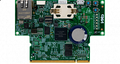

.. _isi_qmc_dgc:

ISI-QMC-DGC-02
####################

Overview
********

Control board, which integrates MCU chip (i.MX RT1176), debugging interface and Ethernet TSN port.

MCU device and part on board is shown below:

 - Device: MIMXRT1176
 - PartNumber: MIMXRT1176CVM8A

