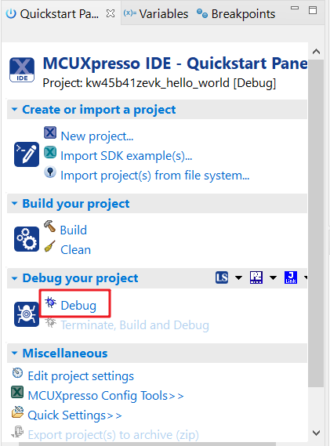
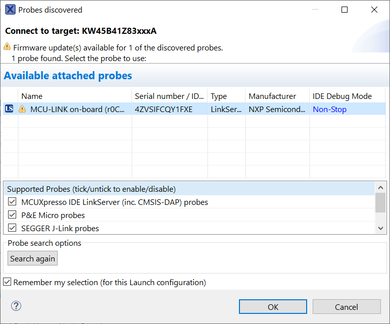

# Run an example application

To download and run the application, perform the following steps:

1.  Connect the development platform to your PC via USB cable between the USB connector \(J14\) and the PC USB connector.
2.  Open the terminal application on the PC, such as PuTTY or TeraTerm, and connect to the debug serial port number \(to determine the COM port number, see [How to determine COM Port](how_to_determine_com_port.md)\). Configure the terminal with these settings:

    1.  115200 or 9600 baud rate, depending on your board \(reference `BOARD_DEBUG_UART_BAUDRATE` variable in `board.h` file\)
    2.  No parity
    3.  8 data bits
    4.  1 stop bit
     configurations")

3.  On the **Quickstart Panel**, click on **Debug**.

    

4.  The first time you debug a project, the **Debug Emulator Selection** dialog is displayed, showing all supported probes that are attached to your computer. Select the probe through which you want to debug and click **OK**. \(For any future debug sessions, the stored probe selection is automatically used, unless the probe cannot be found.\)

    

5.  The application is downloaded to the target and automatically runs to `main()`.

     when running debugging")

6.  Start the application by clicking **Resume**.

    

The `hello_world` application is now running and a banner is displayed on the terminal. If this is not the case, check your terminal settings and connections.

**Parent topic:**[Run a demo using MCUXpresso IDE](../topics/run_a_demo_using_mcuxpresso_ide.md)

