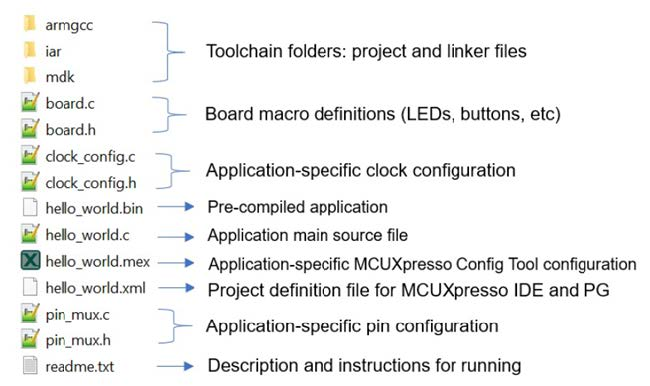

# Example application structure 

This section describes how the various types of example applications interact with the other components in the MCUXpresso SDK. To get a comprehensive understanding of all MCUXpresso SDK components and folder structure, see *MCUXpresso SDK API Reference Manual* \(document MCUXSDKAPIRM\).

Each `<board_name>` folder in the boards directory contains a comprehensive set of examples that are relevant to that specific piece of hardware. Although we use the `hello_world` example \(part of the `demo_apps` folder\), the same general rules apply to any type of example in the `<board_name>` folder.

In the `hello_world` application folder, you see the following contents:

All files in the application folder are specific to that example, so it is easy to copy and paste an existing example to start developing a custom application based on a project provided in the MCUXpresso SDK.

**Note:** To prevent compiling errors, do not use special characters in the path of the SDK such as \{!,@,\#,$,&,%,^\} and space.

**Parent topic:**[MCUXpresso SDK Board Support Package Folders](../topics/mcuxpresso_sdk_board_support_package_folders.md)

