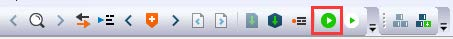
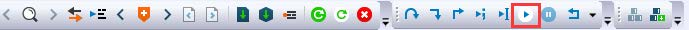
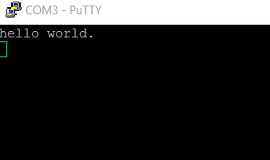

# Run an example application {#run_an_example_application_001}

To download and run the application, perform these steps:

1.  Connect the development platform to your PC via USB cable between the USB connector \(J3\) and the PC USB connector.
2.  Open the terminal application on the PC, such as PuTTY or TeraTerm, and connect to the debug COM port. To determine the COM port number, see [How to determine COM Port](how_to_determine_com_port.md). Configure the terminal with these settings:

    1.  115200 baud rate, depending on your settings \(reference the `BOARD_DEBUG_UART_BAUDRATE` variable in the `board.h` file\)
    2.  No parity
    3.  8 data bits
    4.  1 stop bit
     configuration")

3.  In IAR, click the **Download and Debug** button to download the application to the target.

    

4.  The application is then downloaded to the target and automatically runs to the `main()` function.

     when running debugging")

5.  Run the code by clicking the **Go** button.

    

6.  The `hello_world` application is now running and a banner is displayed on the terminal. If this is not true, check your terminal settings and connections.

    

**Parent topic:**[Running a demo application using IAR](../topics/running_a_demo_application_using_iar.md)

