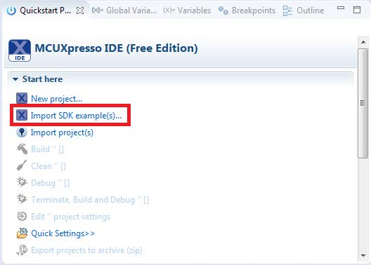
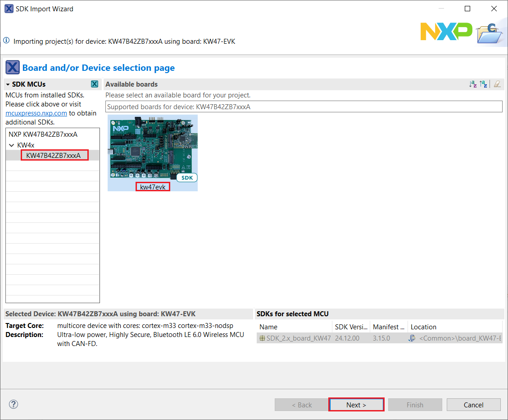
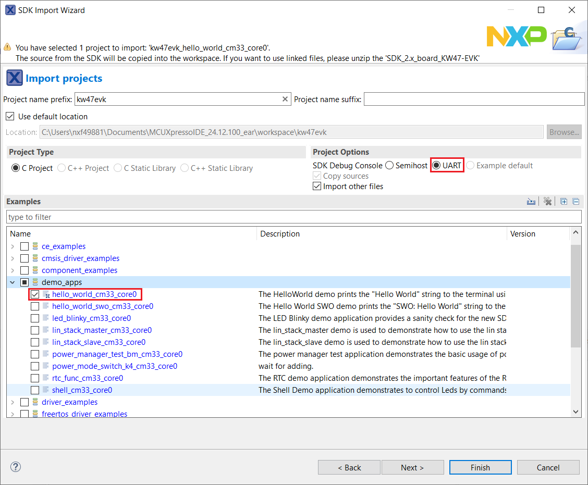
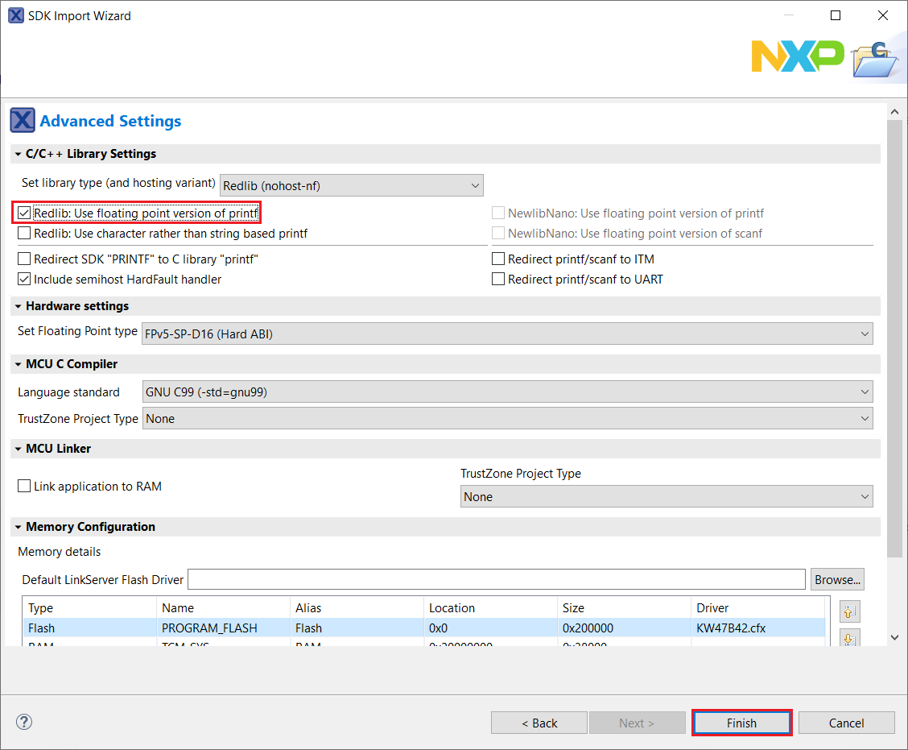

# Building an example application {#build_an_example_application_001}

To build an example application, follow these steps.

1.  Drag and drop the SDK zip file into the **Installed SDKs** view to install an SDK. In the window that appears, click **OK** and wait until the import has finished.

    

2.  On the **Quickstart Panel**, click **Import SDK example\(s\)…**.

    

3.  In the window that appears, expand the **KW4x** folder and select **KW47**. Then, select **kw47evk** and click **Next**.

    

4.  Expand the `demo_apps` folder and select `hello_world`. Then, click **Next**.

    

5.  Ensure **Redlib: Use floating point version of printf** is selected if the example prints floating point numbers on the terminal for demo applications such as `adc_basic`, `adc_burst`, `adc_dma`, and `adc_interrupt`. Otherwise, it is not necessary to select this option. Then, click **Finish**.

    

**Parent topic:**[Run a demo using MCUXpresso IDE](../topics/running_a_demo_using_mcuxpresso_ide.md)

