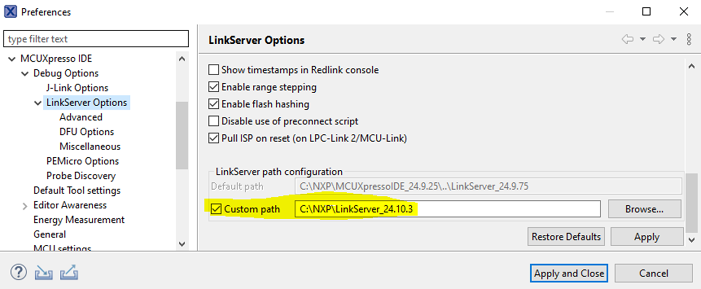

# Run a demo using MCUXpresso IDE {#run_a_demo_using_mcuxpresso_ide}

**Note:** Ensure that the MCUXpresso IDE toolchain is included when generating the MCUXpresso SDK package.

**Note:** The latest MCUX IDE 24.9.25 cannot support KW47 multicore examples compiling, users need to upgrade to the Linkserver\_24.10.22 or higher version, and change the LinkServer path configuration in the MCUX IDE.



This section describes the steps required to configure MCUXpresso IDE to build, run, and debug example applications. The `hello_world` demo application targeted for the KW47-EVK hardware platform is used as an example, though these steps can be applied to any example application in the MCUXpresso SDK.

LinkServer from the [nxp.com](http://nxp.com) does not have support for KW47. It is available only internally. You can download the installer for LinkServer distributed via the [KW47 Early Access Sharepoint](https://nxp1.sharepoint.com/:f:/r/teams/ext131/kw47/Documents/04. Tools?csf=1&web=1&e=xHnOm9).

After the LinkServer is installed, to customize the LinkServer in MCUXpresso IDE, go to **Window** -\> **Preferences** -\> **MCUXpresso IDE** -\> **Debug Options** -\> **LinkServer Options**.


```{include} ../topics/ide_selecting_the_workspace_location.md
:heading-offset: 1
```

```{include} ../topics/ide_building_an_example_application.md
:heading-offset: 1
```

```{include} ../topics/ide_running_an_example_application.md
:heading-offset: 1
```

