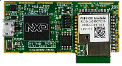

.. _lpc54018iotmodule:

LPC54018-IoT-Module
####################

Overview
********

LPC54018 IoT solution, developed by NXP in partnership with Embedded Artists, is a self-contained, high performance microcontroller solution for development of AWS enabled products. This solution includes an LPC54018-based module with on-board Wi-Fi, and a base board for rapid development and prototyping. NXPs IoT module offers unlimited memory extensibility, and has options to include a root of trust built on the embedded SRAM physical unclonable functions (PUF) and on-chip cryptographic accelerators. And with support for Amazon FreeRTOS on Amazon Web Services (AWS)  the LPC54018 IoT solution offers developers universal connections to AWS.

MCU device and part on board is shown below:

 - Device: LPC54018
 - PartNumber: LPC54018JET180

