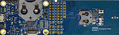

.. _lpc8n04devboard:

LPC8N04DevBoard
####################

Overview
********

The LPC8N04 Development Board provides a powerful and flexible development system for NXP's innovative, NFC-enabled LPC8N04 Arm Cortex-M0+ based MCU. The board can be used with a range of development tools, including the MCUXpresso IDE toolchain. The board is complemented by a sample smartphone application and firmware to utilize the built-in LED array and speaker in a scrolling message demo application with option for music playback. The LPC8N04 process section of the board, with its integral antenna, can be detached for deployment in prototype or proof-of-concept designs. The board also includes an onboard CMSIS-DAP debug probe which is supported by most IDEs, so development can be started with no additional cost.

MCU device and part on board is shown below:

 - Device: LPC8N04
 - PartNumber: LPC8N04FHI24

