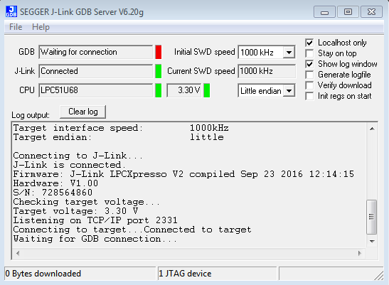
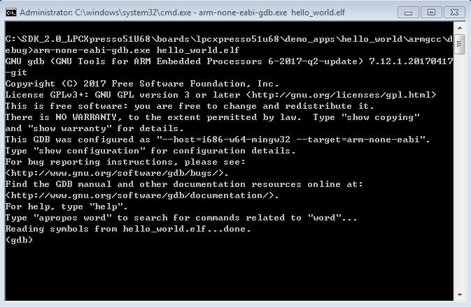

# Run an example application

This section describes steps to run a demo application using J-Link GDB Server application. To perform this exercise, two things must be done:

-   Make sure that:
    -   You have a standalone J-Link pod that is connected to the debug interface of your board. Note that some hardware platforms require hardware modification in order to function correctly with an external debug interface.

After the J-Link interface is configured and connected, follow these steps to download and run the demo applications:

1.  Connect the development platform to your PC via USB cable between the Link2 USB connector and the PC USB connector. If you are connecting for the first time, allow about 30 seconds for the devices to enumerate.
2.  Open the terminal application on the PC, such as PuTTY or TeraTerm, and connect to the debug serial port number \(to determine the COM port number, see Appendix A\). Configure the terminal with these settings:
    1.  115200 or 9600 baud rate, depending on your board \(reference BOARD\_DEBUG\_UART\_BAUDRATE variable in board.h file\)
    2.  No parity
    3.  8 data bits
    4.  1 stop bit

         configurations")

3.  Open the J-Link GDB Server application. Assuming the J-Link software is installed, the application can be launched by going to the Windows operating system Start menu and selecting “Programs -\> SEGGER -\> J-Link <version\> J-Link GDB Server”.
4.  Modify the settings as shown below. The target device selection chosen for this example is the LPC51U68
5.  After it is connected, the screen should resemble this figure:

    

6.  If not already running, open a GCC Arm Embedded tool chain command window. To launch the window, from the Windows operating system Start menu, go to “Programs -\> GNU Tools Arm Embedded <version\>” and select “GCC Command Prompt”.

    

7.  Change to the directory that contains the example application output. The output can be found in using one of these paths, depending on the build target selected:

    *<install\_dir\>/boards/<board\_name\>/<example\_type\>/<application\_name\>/armgcc/debug*

    *<install\_dir\>/boards/<board\_name\>/<example\_type\>/<application\_name\>/armgcc/release*

    For this example, the path is:

    *<install\_dir\>/boards/lpcxpresso51U68/demo\_apps/hello\_world/armgcc/debug*

8.  Run the command “arm-none-eabi-gdb.exe <application\_name\>.elf”. For this example, it is “arm-none-eabi-gdb.exe hello\_world.elf”.

    

9.  Run these commands:
    1.  "target remote localhost:2331"
    2.  "monitor reset"
    3.  "monitor go"
    4.  "monitor halt"
    5.  "load"
    6.  "monitor reg pc=\(0x4\)"
    7.  "monitor reg msp=\(0x0\)"
10. The application is now downloaded and halted at the reset vector. Execute the “monitor go” command to start the demo application.

    The hello\_world application is now running and a banner is displayed on the terminal. If this is not true, check your terminal settings and connections.

    

**Parent topic:**[Run a demo using Arm® GCC](../topics/run_a_demo_using_arm__gcc.md)

