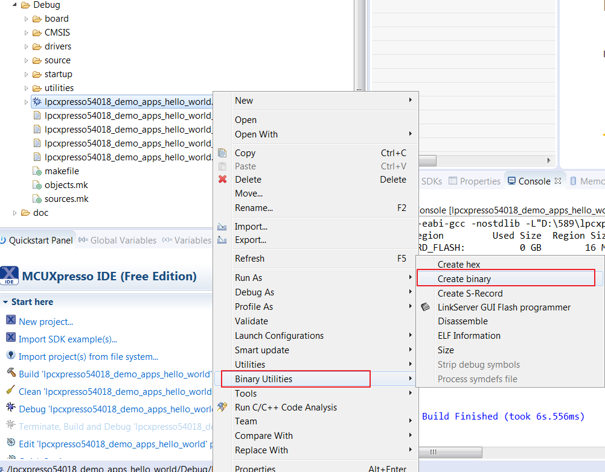
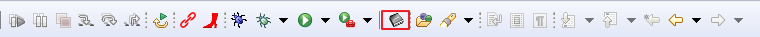
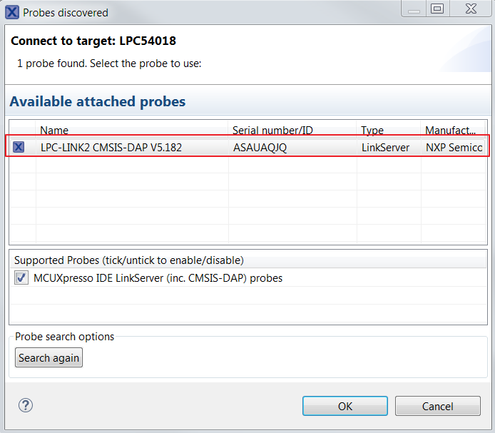
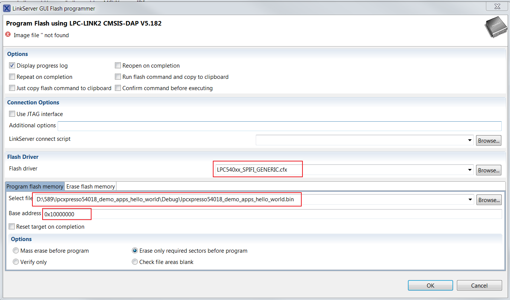
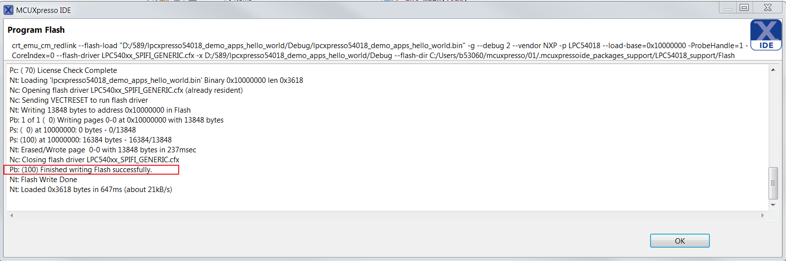

# How to program the non-XIP \(plain load\) example bin file to external flash

To build an example application, follow these steps.

1.  Create a bin file for non-XIP \(plain load\) demo from \*.axf file.

    

2.  Click the “LinkServer GUI Flash Programmer” button.

    

3.  Select LPC-LINK2 CMSIS-DAP.

    

4.  Select the flash driver, bin file, and external flash program address, then click the "OK" button to program the bin file to external flash.

    

5.  After programming, press the reset button on the board to run the example.

    

**Parent topic:**[Run a demo using MCUXpresso IDE](../topics/run_a_demo_using_mcuxpresso_ide.md)

