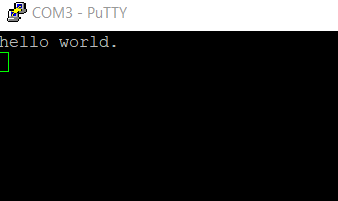

# Run a non-XIP \(plain load\) example application

1.  To debug the application, click the “Start/Stop Debug Session” button, highlighted in red.

    **Note:** The application is only downloaded into the SRAM when debugging. If you need to program the image to external flash, see *Section 4.4, "How to program the non-XIP \(plain load\) example application to external flash"*.

     when run debugging")

2.  Run the code by clicking the “Run” button to start the application.

    

    The hello\_world application is now running and a banner is displayed on the terminal. If this is not true, check your terminal settings and connections.

    

**Parent topic:**[Run a demo using Keil® MDK/μVision](../topics/run_a_demo_using_keil__mdk_vision.md)

