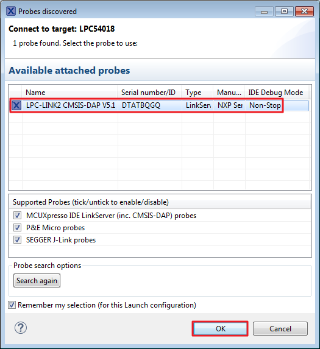
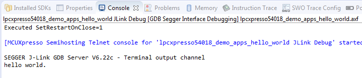

# Run a non-XIP \(plain load\) example application

For more information on debug probe support in the MCUXpresso IDE v10.1.1, visit [community.nxp.com](https://community.nxp.com/message/630901).

To download and run the application, perform these steps:

1.  Reference the table in Appendix B to determine the debug interface that comes loaded on your specific hardware platform. For LPCXpresso boards, install the DFU jumper for the debug probe, then connect the debug probe USB connector.
2.  Open the terminal application on the PC, such as PuTTY or TeraTerm, and connect to the debug serial port number \(to determine the COM port number, see Appendix A\). Configure the terminal with these settings:

    1.  115200 or 9600 baud rate, depending on your board \(reference BOARD\_DEBUG\_UART\_BAUDRATE variable in board.h file\)
    2.  No parity
    3.  8 data bits
    4.  1 stop bit
     configurations")

3.  On the *Quickstart Panel*, click on "Debug 'lpcxpresso54018\_demo\_apps\_hello\_world’ \[Debug\]”.

    

4.  The first time you debug a project, the Debug Emulator Selection Dialog is displayed, showing all supported probes that are attached to your computer. Select the probe through which you want to debug and click the “OK” button. \(For any future debug sessions, the stored probe selection is automatically used, unless the probe cannot be found.\)

    

5.  The application is downloaded to the target and automatically runs to main\(\):

     when running debugging")

    **Note:** The application is only downloaded into the SRAM when debugging. If you need to program the image to external flash, see *Section 6.4, "How to program the non-XIP \(plain load\) example bin file to external flash"*.

6.  Start the application by clicking the "Resume" button.

    

The hello\_world application is now running and a banner is displayed on the console.

**Parent topic:**[Run a demo using MCUXpresso IDE](../topics/run_a_demo_using_mcuxpresso_ide.md)

