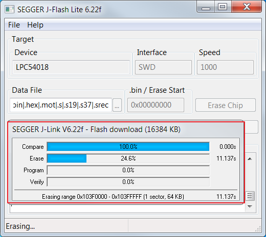
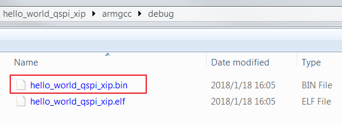
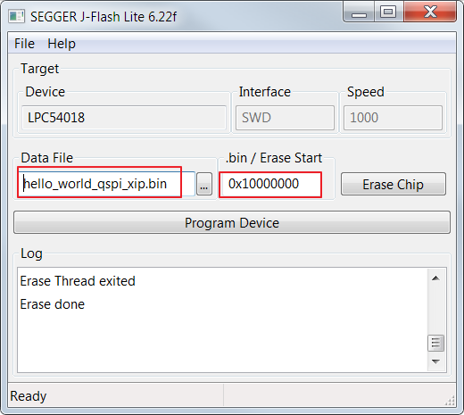
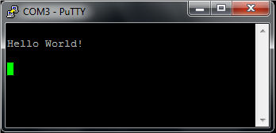

# Run an XIP example application

1.  Use the J-FLASH-Lite \(with version higher than V6.22\) to erase the chip.

    

2.  Wait for the flash erase finish.

    

    **Note:** If you cannot erase, press the SW4 button then press the reset button to enter ISP mode. Then, click erase again \(keep pressing the SW4 button all the time\).

3.  Program the binary file into external flash.

    

    

    **Note:** Make sure the ‘.bin/Erase Start’ address is 0x10000000 \(the external flash base address\).

4.  After programming, press the reset button to run.

    

**Parent topic:**[Run a demo using Arm® GCC](../topics/run_a_demo_using_arm__gcc.md)

