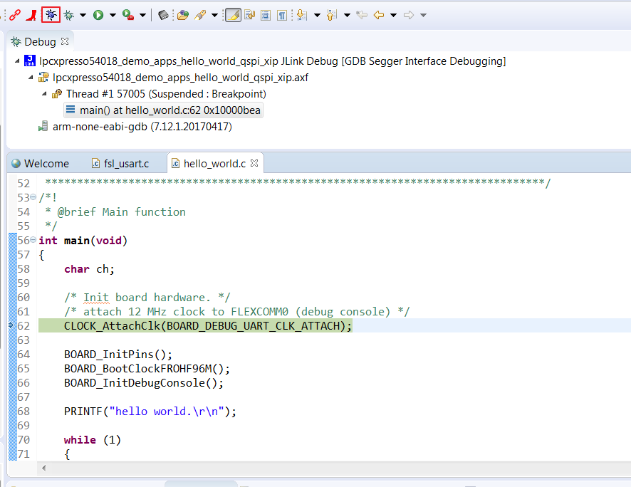

# Run an XIP example application

1.  Click the "Debug" button on the tool bar to run the XIP example.

    

**Parent topic:**[Run a demo using MCUXpresso IDE](../topics/run_a_demo_using_mcuxpresso_ide.md)

