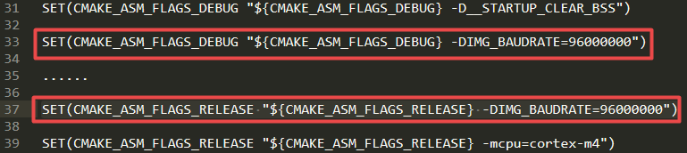

# Updating SPIFI clock frequency in Arm® GCC

-   In Armgcc, open the `CMakeLists.txt` file.
-   Add two line settings.

    ```
    SET(CMAKE_ASM_FLAGS_DEBUG "${CMAKE_ASM_FLAGS_DEBUG}-DIMG_BAUDRATE=96000000")
    ```

    ```
    SET(CMAKE_ASM_FLAGS_RELEASE "${CMAKE_ASM_FLAGS_RELEASE}-DIMG_BAUDRATE=96000000")
    ```

    .




**Parent topic:**[How to update SPIFI clock Frequency](../topics/how_to_update_spifi_clock_frequency.md#)

