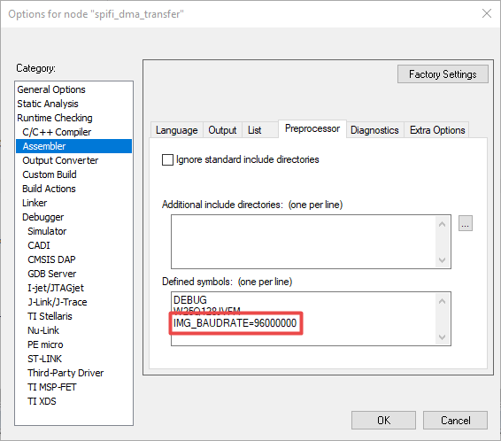

# Updating SPIFI clock frequency in IAR

-   In IAR, right click **Project** and choose **Options**. Then, click **Assembler** and **Preprocessor**.
-   Add **IMG\_BAUDRATE=96000000** in **Defined symbols: \(one per line\)**, as shown in [Figure 1](updating_spifi_clock_frequency_in_iar.md#IARASSEMBLERSETTING).

**Parent topic:**[How to update SPIFI clock Frequency](../topics/how_to_update_spifi_clock_frequency.md#)

