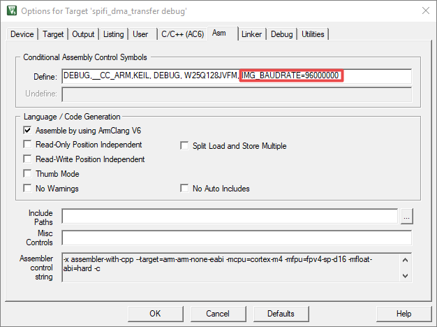

# Updating SPIFI clock frequency in Keil® MDK/μVision

-   In Keil, right click **Project** and choose **Options**. Then, click **Asm**.
-   Add **IMG\_BAUDRATE=96000000** in **Define**, as shown in [Figure 1](updating_spifi_clock_frequency_in_keil__mdk_vision.md#KEILASMSETTING).

**Parent topic:**[How to update SPIFI clock Frequency](../topics/how_to_update_spifi_clock_frequency.md#)

