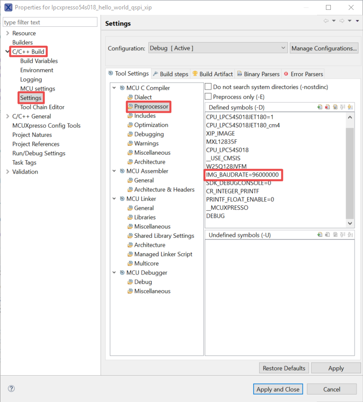

# Updating SPIFI clock frequency in MCUXpresso IDE

-   In MCUXpresso IDE, right click project and choose `Properties`.
-   Click **C/C++ Build** and choose **Settings**. Click **Preprocessor** in **Tool Settings**.
-   Add **IMG\_BAUDRATE=96000000** in **Defined symbols\(-D\)**, as shown in [Figure 1](updating_spifi_clock_frequency_in_mcuxpresso_ide.md#MCUXPRESSOSETTING).

**Parent topic:**[How to update SPIFI clock Frequency](../topics/how_to_update_spifi_clock_frequency.md#)

