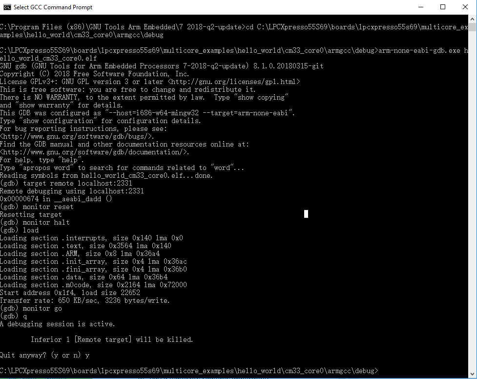
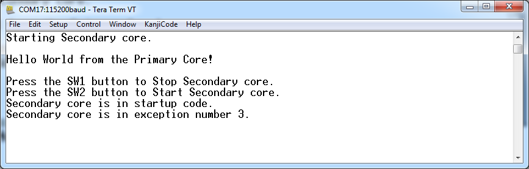

# Run a multicore example application {#GUID-4508648E-1BE8-4844-9A69-D8DED66AB1E0}

When running a multicore application, the same prerequisites for J-Link/J-Link OpenSDA firmware, and the serial console as for the single-core application, applies, as described in [Run an example application](run_an_example_application_003.md#).

The primary core debugger handles flashing of both the primary and the auxiliary core applications into the SoC flash memory. To download and run the multicore application, switch to the primary core application project and perform steps 1 to 10, as described in [Run an example application](run_an_example_application_003.md#). These steps are common for both single-core and dual-core applications in Arm GCC.

Both the primary and the auxiliary image is loaded into the SPI flash memory. After execution of the `monitor go` command, the primary core application is executed. During the primary core code execution, the auxiliary core code is reallocated from the flash memory to the RAM, and the auxiliary core is released from the reset. The `hello_world` multicore application is now running and a banner is displayed on the terminal. If this is not true, check your terminal settings and connections.

|

|

|

|

**Parent topic:**[Run a demo using Arm GCC](../topics/run_a_demo_using_arm__gcc.md)

