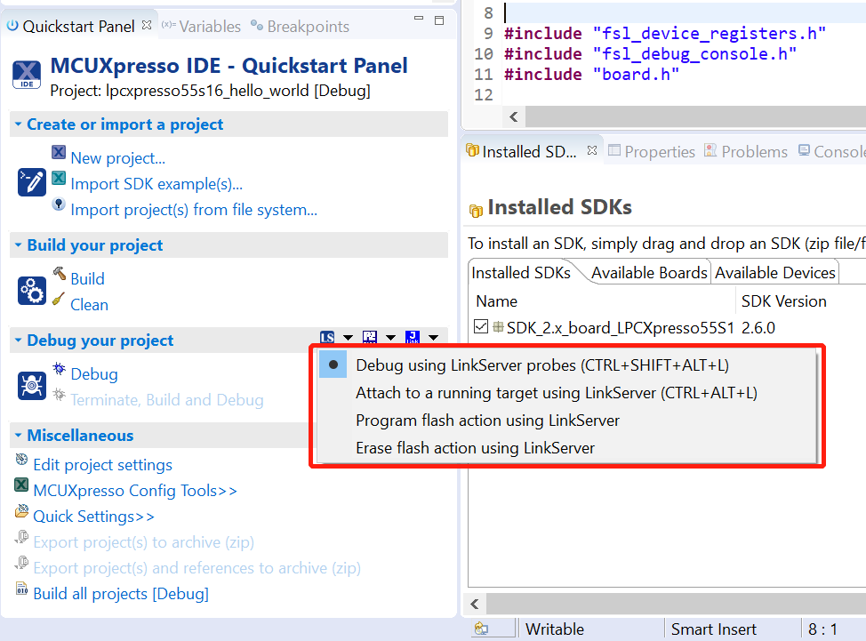
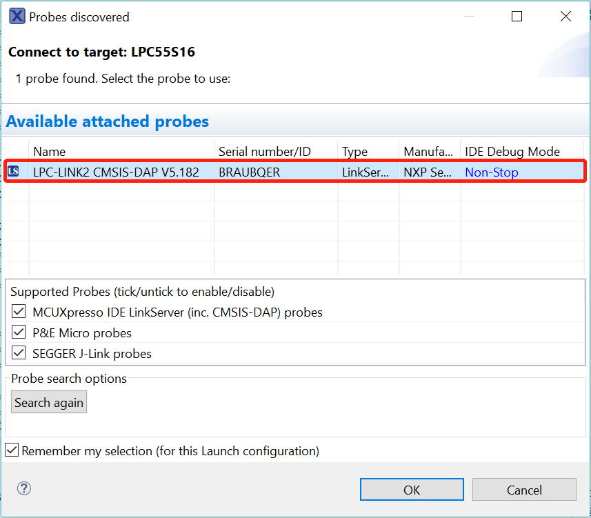

# Run an example application

For more information on debug probe support in the MCUXpresso IDE, see [community.nxp.com](https://community.nxp.com/message/630901).

To download and run the application, perform the following steps:

1.  See the table in  to determine the debug interface that comes loaded on your specific hardware platform. For LPCXpresso boards, install the DFU jumper for the debug probe, then connect the debug probe USB connector.
    -   For boards with CMSIS-DAP/mbed/DAPLink interfaces, visit [developer.mbed.org/handbook/Windows-serial-configuration](http://developer.mbed.org/handbook/Windows-serial-configuration) and follow the instructions to install the Windows® operating system serial driver. If running on Linux® OS, this step is not required.
    -   For boards with a P&E Micro interface, see [PE micro](http://www.pemicro.com/support/downloads_find.cfm) to download and install the P&E Micro Hardware Interface Drivers package.
    -   For the MRB-KW01 board, see [www.nxp.com/USB2SER](www.nxp.com/USB2SER) to download the serial driver. This board does not support the OpenSDA. Therefore, an external debug probe \(such as a J-Link\) is required. The steps below referencing the OpenSDA do not apply because there is only a single USB connector for the serial output.
    -   If using J-Link with either a standalone debug pod or OpenSDA, install the J-Link software \(drivers and utilities\) from [www.segger.com/jlink-software.html](www.segger.com/jlink-software.html).
    -   For boards with the OSJTAG interface, install the driver from [www.keil.com/download/docs/408](www.keil.com/download/docs/408).
2.  Connect the development platform to your PC via a USB cable.
3.  Open the terminal application on the PC, such as PuTTY or TeraTerm, and connect to the debug serial port number \(to determine the COM port number, see [How to determine COM port](how_to_determine_com_port.md)\). Configure the terminal with these settings:

    1.  115200 or 9600 baud rate, depending on your board \(reference `BOARD_DEBUG_UART_BAUDRATE` variable in `board.h` file\)
    2.  No parity
    3.  8 data bits
    4.  1 stop bit
     configurations")

4.  On the **Quickstart Panel**, click on **Debug `lpcxpresso55s16_hello_world [Debug]`** to launch the debug session.

    

5.  The first time you debug a project, the **Debug Emulator Selection** dialog is displayed, showing all supported probes that are attached to your computer. Select the probe through which you want to debug and click **OK**. \(For any future debug sessions, the stored probe selection is automatically used, unless the probe cannot be found.\)

    

    

6.  The application is downloaded to the target and automatically runs to `main()`.

     when running
                debugging")

7.  Start the application by clicking **Resume**.

    

The `hello_world` application is now running and a banner is displayed on the terminal. If this is not the case, check your terminal settings and connections.

**Parent topic:**[Run a demo using MCUXpresso IDE](../topics/run_a_demo_using_mcuxpresso_ide.md)

