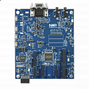

.. _lpcxpresso55s16:

LPCXpresso55S16
####################

Overview
********

The LPCXpresso55S16 board is an LPCXpresso V3 style board, the latest generation of the original and highly successful LPCXpresso board family. "Arduino UNO" compatible shield connectors are included, with additional expansion ports around the Arduino footprint, along with a PMod/host interface port and Mikroelekronika Click module site. The board features an on-board LPC-Link2 debug probe based on the LPC4322 MCU for a performance debug experience over high speed USB, with easy firmware update options to support CMSIS-DSP or a special version of J-link LITE from SEGGER. The board can also be used with an external debug probe such as those from SEGGER and P&E.

The LPC5500 series is fully supported by NXPs MCUXpresso suite of free software and tools, which include an Eclipse-based IDE, configuration tools and extensive SDK drivers/examples available at https://mcuxpresso.nxp.com. MCUXpresso SDK includes project files for use with IDEs from lead partners Keil and IAR.

MCU device and part on board is shown below:

 - Device: LPC55S16
 - PartNumber: LPC55S16JBD100

