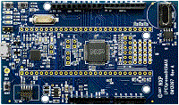

.. _lpcxpresso845max:

LPCXpresso845MAX
####################

Overview
********

LPC84x family boards and devices are fully supported by NXPs\ `MCUXpresso suite <https://www.nxp.com/mcuxpresso>`__\ of free software and tools, which include an Eclipse-based IDE, configuration tools and extensive SDK drivers/examples available at\ `https://mcuxpresso.nxp.com <https://mcuxpresso.nxp.com/>`__. All boards in this series include an on-board CMSIS-DAP debug probe based on the LPC11U35 debug probe, with the option for an external debug probe such as those from SEGGER and PE Micro. Popular Arduino UNO shield boards can be used on these boards, enabling quick and easy prototyping.The LPC84x family is fully supported by NXPs\ `MCUXpresso suite <https://www.nxp.com/mcuxpresso>`__\ of free software and tools, which include an Eclipse-based IDE, configuration tools and extensive SDK drivers/examples available at\ `https://mcuxpresso.nxp.com <https://mcuxpresso.nxp.com/>`__. MCUXpresso SDK includes project files for use with IDEs from lead partners Keil and IAR, and these IDEs are also fully supported by the MCUXpresso pin, clock and peripheral configuration tools.

MCU device and part on board is shown below:

 - Device: LPC845
 - PartNumber: LPC845M301JBD64

