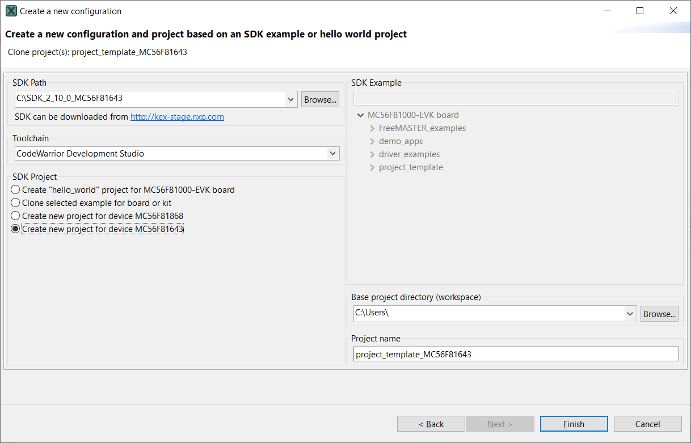

# MCUXpresso Config Tool support

Steps to generate the project template project for specific derivative part number by MCUXpresso Config Tool:

1.  Download the specific device SDK package and unzip it.

    **Note:** Since the project template requires freemaster, select the middleware freemaster in the SDK builder when downloading.

2.  Use MCUXpresso Config Tool. See tool version in the Release Note document. To create a project template project, as shown in [Figure 1](mcuxpresso_config_tool_support.md#FIG_TOOLSUPPORT).

    |

|

3.  Import the generated template project into CodeWarrior IDE and start the development. By now, a config tool file \(extension `.mex`\) with the same project name as shown in [Figure 1](mcuxpresso_config_tool_support.md#FIG_TOOLSUPPORT) is also generated in the generated project folder. This config tool file achieve easy configurations for pins, clocks, and peripherals.

**Parent topic:**[Project template project for a specific DSC part](../topics/project_template_project_for_a_specific_dsc_part.md)

