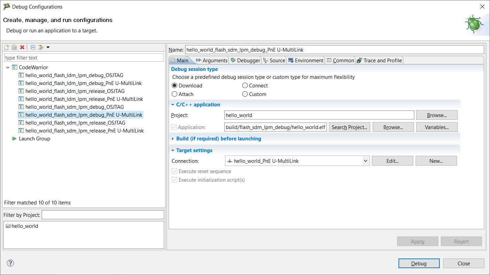
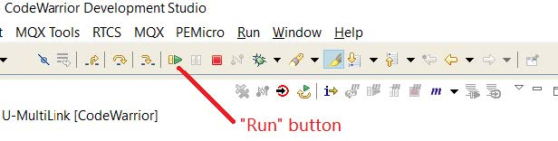
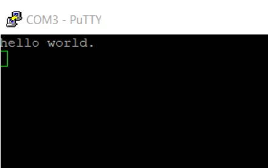

# Run an example application

Perform the following steps to download and run the application.

1.  Connect the MC56F81000-EVK USB port, **J12**, to your PC via USB cable. This USB port is used for on-board multilink debugger.
2.  Connect the MC56F81000-EVK USB port, **J26**, to your PC via USB cable. This USB port is used for on-board CP2102 USB to UART bridge.
3.  Install the MultiLink driver as PC hint if it is the first time you run it on your PC. The MultiLink driver are provided by Codewarrior by default. The USB to UART bridge \(CP2102\) driver may be found on the internet or [SILICON LAB](HTTPS://WWW.SILABS.COM/).
4.  Open the terminal application on the PC, such as PuTTY or TeraTerm, and connect to the debug COM port \(to determine the COM port number, see [How to determine COM port](how_to_determine_com_port.md)\). Configure the terminal with these settings:

    1.  115200, defined by `BOARD_DEBUG_UART_BAUDRATE` in the *board.h* file
    2.  No parity
    3.  8 data bits
    4.  1 stop bit
    | configuration")

|

5.  For this example, click **Debug** in the **Commander** pane, and select the **hello\_world\_flash\_sdm\_lpm\_debug\_PnE U-MultiLink** launch configuration.

    |

|

    |

|

    Then the application is downloaded onto target board and automatically runs to the `main()` function.

    Click **Run** on the toolbar to run the code.

    **Note:**

    1.  Generally there are four build configuration for DSC SDK 2.x.x: `flash_sdm_lpm_debug`, `flash_sdm_lpm_release`, `flash_ldm_lpm_debug`, and `flash_ldm_lpm_release`.

        `debug` uses optimization level 1 and `release` uses optimization level 4. `sdm` means small data memory model. `ldm` means large data memory model. `lpm` means large program memory model.

    2.  Check each demo `readme` document, which includes detail instructions for HW and SW settings.
    |

|

6.  The `hello_world` application is now running and a banner is displayed on the terminal, as shown in [Figure 5](run_an_example_application.md#FIG_TEXTDISPLAYHELLOWORLD). If it does not appear, check your terminal settings and connections.

    |

|

**Parent topic:**[Run a demo application using CodeWarrior](../topics/run_a_demo_application_using_codewarrior.md)

