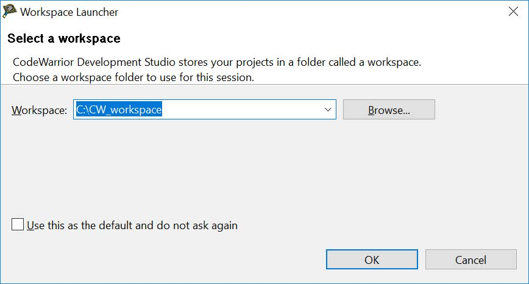
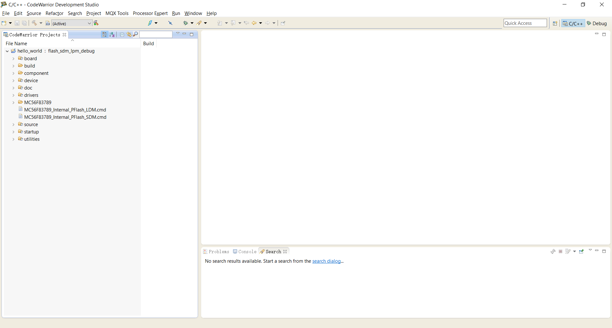

# Build an example application

To build the `hello_world` example application, perform the following example steps:

1.  Launch CodeWarrior and in the workspace launcher, choose a workspace which holds the projects to use. If the dialogue box does not pop up, enter a workspace folder and create one workspace.

    |

|

    Then the CodeWarrior Development Studio workspace with empty projects appears.

    |

|

2.  Import the project into the workspace.

    Click **Import project** in the **Commander** pane. A form pops up. Click **Browse** to the SDK install directory.

    |

|

    Then all available demo projects are shown as [Figure 3](build_an_example_application.md#FIG_PROJECTIMPORT). Select the `hello_world` project in the list and click **Finish**.

    If you already know the project location, navigate to the folder when clicking **Browse**, and only one project can be seen.

    To locate most example application workspace files, use the following path:

    ```
    <install_dir>/boards/<board_name>/<example_type>/<application_name>/codewarrior
    ```

    Using the MC56F83000-EVK hardware platform as an example, the `hello_world` workspace is located in:

    ```
    <install_dir>/boards/evkmc56f83000/demo_apps/hello_world/codewarrior
    ```

3.  Select the desired build target from the drop-down menu. For this example, select **hello\_world** – **flash\_sdm\_lpm\_debug**, as shown in [Figure 4](build_an_example_application.md#FIG_DEMOBUILDTARGET).

    |

|

4.  To build the demo application, click **Build \(All\)** in the **Commander** pane.
5.  The build completes without errors.

**Parent topic:**[Run a demo application using CodeWarrior](../topics/run_a_demo_application_using_codewarrior.md)

