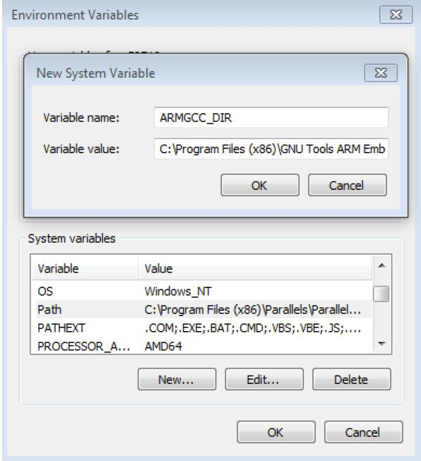

# Add a new system environment variable for ARMGCC\_DIR

Create a new *system* environment variable and name it `ARMGCC_DIR`. The value of this variable should point to the Arm GCC Embedded tool chain installation path.

```
C:\Program Files (x86)\GNU Tools Arm Embedded\9 2019-q4-major
```

Reference the installation folder of the GNU Arm GCC Embedded tools for the exact path name.

|

|

**Parent topic:**[Set up toolchain](../topics/set_up_toolchain.md)

