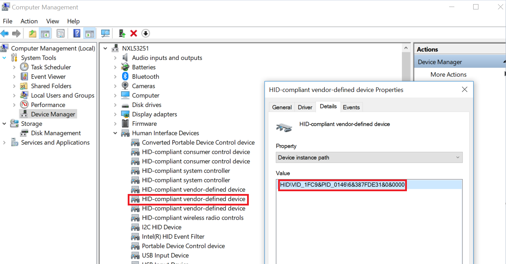

# Switch to Download Mode

The board needs to be in Download Mode mode for UUU to download images:

1.  Set the board boot mode to Download Mode \[SW1301\[3:0\] = 0011\(Single Boot Mode\)/1011\(Low Power Boot Mode\)\].
2.  Connect the development platform to your PC via USB cable between the DBG USB connector \(J1401\) and the PC USB connector.
3.  Connect J403 \(USB1\) to PC USB connector for downloading.
4.  The PC recognizes the i.MX 93 device as \(VID:PID\)=\(1FC9:0146\), as shown in [Figure 1](switch_to_download_mode.md#DEVICEMANAGER).

    |

|

**Parent topic:**[Set up environment](../topics/set_up_environment.md)

