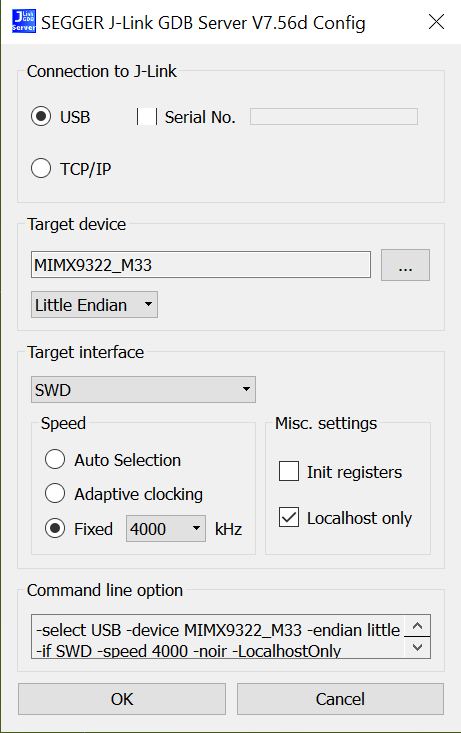
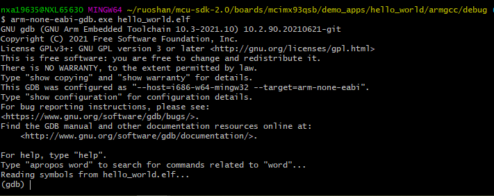

# Run an example application

This section describes steps to run a demo application using J-Link GDB Server application.

To perform this exercise, the following step must be done.

1.  Connect the development platform to your PC via USB cable between the DBG USB connector and the PC USB connector.
2.  Connect 12 V ~ 20 V power supply and J-Link Plus to the device.
3.  Switch SW601\[1:4\] to the M core boot and ensure that the image is not available on the boot source. For example, 0b1011 for MicroSD boot. Keep the SD slot empty.
4.  Open the terminal application on the PC, such as PuTTY or TeraTerm, connect to the debug COM port, see [How to determine COM port](how_to_determine_com_port.md#), and configure the terminal with these settings:
    1.  115200 baud rate
    2.  No parity
    3.  8 data bits
    4.  1 stop bit

        | configurations")

|

5.  Power on the board.
6.  Open the J-Link GDB Server application. Assuming the J-Link software is installed, the application can be launched by going to the Windows operating system **Start** menu and selecting **Programs** -\> **SEGGER** -\> **J-Link <version\> J-Link GDB Server**.
7.  Modify the settings as shown in [Figure 2](run_an_example_application_003.md#SEGGGERJKLINKCONFIG). The target device selection chosen for this example is MIMX9322\_M33 .

    |

|

8.  After GDB server is running, the screen should resemble [Figure 3](run_an_example_application_003.md#SEGGGERJKLINKSUCCESS):

    |

|

9.  If not already running, open a GCC Arm Embedded tool chain command window. To launch the window, from the Windows operating system **Start** menu, go to **Programs** -\> **GNU Tools Arm Embedded <version\>** and select **GCC Command Prompt**.

    |

|

10. Change to the directory that contains the example application output. The output can be found in using one of these paths, depending on the build target selected:

    ```
    <install_dir>/boards/<board_name>/<example_type>/<application_name>/armgcc/debug
    ```

    ```
    <install_dir>/boards/<board_name>/<example_type>/<application_name>/armgcc/release
    ```

    For this example, the path is:

    ```
    <install_dir>/boards/mcimx93qsb/demo_apps/hello_world/armgcc/debug
    ```

11. Run the command of `arm-none-eabi-gdb.exe <application_name>.elf`. For this example, it is `arm-none-eabi-gdb.exe hello_world.elf`.

    |

|

12. Run these commands:
    1.  `target remote localhost:2331`
    2.  `monitor reset`
    3.  `monitor halt`
    4.  `load`
13. The application is now downloaded and halted at the reset vector. Execute the `monitor go` command to start the demo application.

The `hello_world` application is now running and a banner is displayed on the terminal. If this is not true, check your terminal settings and connections.

|

|

**Note:** If the software is already running on the M core, the debugger loading image into TCM may get HardFault or a data verification issue. NXP recommends you to follow the steps above to use the debugger. Repowering the board is required to restart the debugger.

**Parent topic:**[Windows OS host](../topics/windows_os_host.md)

