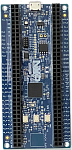

.. _mcxn9xxbrk:

MCX-N9XX-BRK
####################

Overview
********

| The NXP MCX-N9XX-BRK is a development board for the N9xx 150 MHz Arm Dual Cortex-M33 TrustZone microcontroller, which is for Industrial and Consumer IoT Applications.

MCU device and part on board is shown below:

 - Device: MCXN947
 - PartNumber: MCXN947VDF

