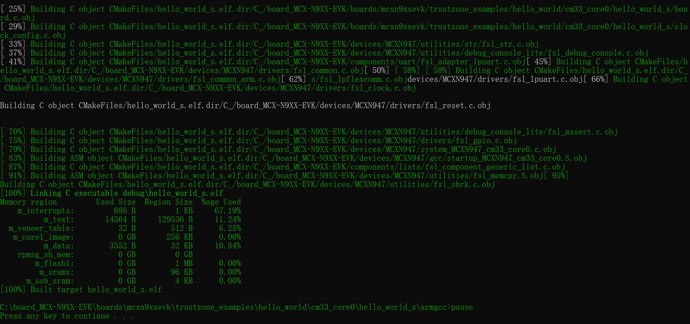

# Build a TrustZone example application 
This section describes the steps to build and run a TrustZone application. The demo application build scripts are located in this folder:

```
<install_dir>/boards/<board_name>/trustzone_examples/<application_name>/<core_type>/iar/<application_name>_ns/armgcc
```

```
<install_dir>/boards/<board_name>/trustzone_examples/<application_name>/<core_type>/iar/<application_name>_s/armgcc
```

Begin with a simple TrustZone version of the Hello World application. The TrustZone Hello World GCC build scripts are located in this folder:

```
<install_dir>/boards/mcxn9xxevk/trustzone_examples/hello_world/hello_world_ns/iar/hello_world_ns.eww
```

```
<install_dir>/boards/mcxn9xxevk/trustzone_examples/hello_world/hello_world_s/iar/hello_world_s.eww
```

```
<install_dir>/boards/mcxn9xxevk/trustzone_examples/hello_world/hello_world_s/iar/hello_world.eww
```

Build both applications separately, following steps for single core examples as described in [Build an example application](arm_gcc_build_an_example_application.md). It is requested to build the application for the secure project first, because the non-secure project needs to know the secure project, since CMSE library is running the linker. It is not possible to finish the non-secure project linker with the secure project because the CMSE library is not ready.




**Parent topic:**[Run a demo using Arm GCC](../topics/arm_gcc_run_a_demo_application.md)

