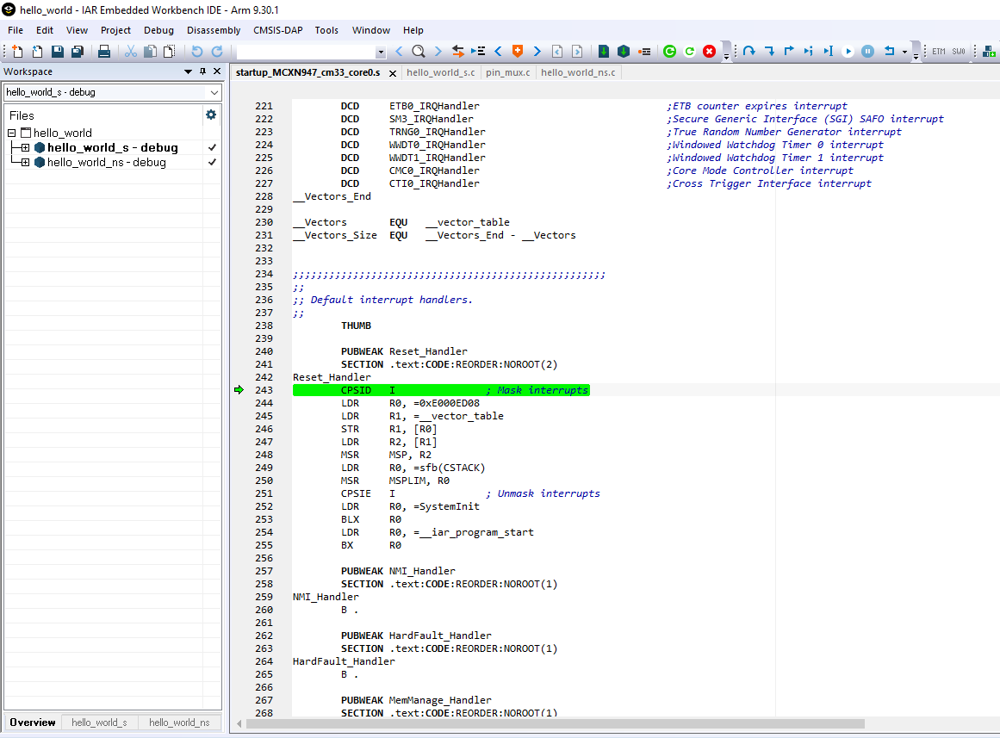
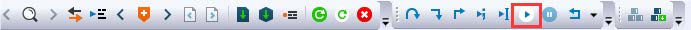
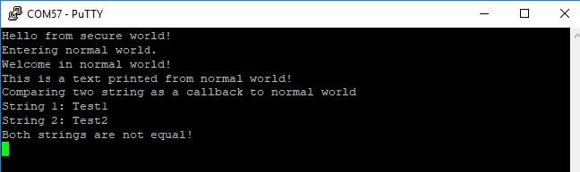

# Run a TrustZone example application {#topic_ldq_rjx_lvb}

The secure project is configured to download both secure and non-secure output files, so debugging can be fully managed from the secure project. To download and run the TrustZone application, switch to the secure application project and perform Steps [1](iar_run_an_example_application.md#step1) – [4](iar_run_an_example_application.md#step4) as described in [Run an example application](iar_run_an_example_application.md). These steps are common for both single core, dual-core,and TrustZone applications in IAR. After clicking **Download and Debug**, both the secure and non-secure image are loaded into the device flash memory, and the secure application is executed. It stops at the `Rest_Hander` function.

Run the code by clicking **Go** to start the application.

The TrustZone `hello_world` application is now running and a banner is displayed on the terminal. If this is not true, check your terminal settings and connections.

**Parent topic:**[Run a demo application using IAR](../topics/iar_run_a_demo_application.md)

